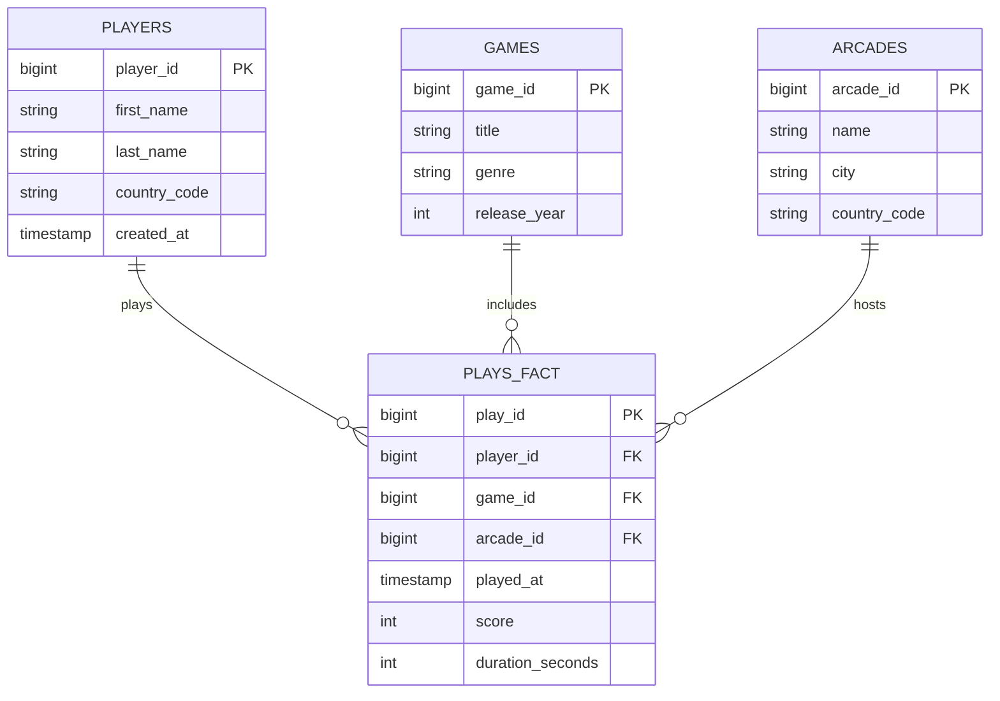

---
# try also 'default' to start simple
theme: ../slidev-theme-soma
# some information about your slides (markdown enabled)
title: Comment choisir sa base de données
info: |
  ## Comment choisir sa base de données
  Besoins, performances & scalabilité
# apply UnoCSS classes to the current slide
class: text-center
# https://sli.dev/features/drawing
drawings:
  persist: false
# slide transition: https://sli.dev/guide/animations.html#slide-transitions
transition: fade
# enable MDC Syntax: https://sli.dev/features/mdc
mdc: true
hideInToc: true
---

<div class="flex items-center justify-center">
  <div class="flex flex-col items-end text-right">
    <h1 class="text-4xl font-extrabold text-gray-800 dark:text-white mb-2">Comment choisir sa base de données</h1>
    <h2 class="text-xl font-semibold text-gray-800 dark:text-gray-300">
      Besoins, performances & scalabilité
    </h2>
    <span class="text-lg font-bold text-gray-700 dark:text-gray-400 mt-4">
      Hugues GAILLARD - Novembre 2025
    </span>
  </div>
  <div style="margin-bottom: 128px;">
      <Compass />
  </div>
</div>

<div style="position: absolute; right: 2rem; bottom: 2rem;">
  
</div>

<!-- <div @click="$slidev.nav.next" class="mt-12 py-1" hover:bg="white op-10">
  Press Space for next page <carbon:arrow-right />
</div> -->

<!--
The last comment block of each slide will be treated as slide notes. It will be visible and editable in Presenter Mode along with the slide. [Read more in the docs](https://sli.dev/guide/syntax.html#notes)
-->

---
layout: two-cols
layoutClass: gap-16
hideInToc: true
---

# Au sommaire

Dans cette Masterclass, nous allons explorer les différentes bases de données et leurs spécificités.

<div style="margin: auto; width: 250px;">
  <Compass />
</div>

À la fin de cette heure, vous aurez une culture & une grille de lecture claire pour faire des choix éclairés et justifiés.

::right::

<Toc text-sm minDepth="1" maxDepth="2" />

---
layout: center
---

# Tour d'horizon

---
---
# Un peu d'histoire

<style scoped>
.progress-bar {
  position: absolute;
  top: 2.8rem;
  left: 6rem;
  right: 6rem;
  height: 6px;
  z-index: 0;
}

.progress-bar::before {
  content: '';
  position: absolute;
  top: 0;
  left: 0;
  height: 100%;
  background: linear-gradient(to right, var(--soma-pink), var(--soma-blue));
  width: 0%;
  transition: width 0.5s ease-out;
  box-shadow: 0 0 28px rgba(129, 129, 129, 0.67);
}

.progress-bar.step-1::before { width: 0%; }
.progress-bar.step-2::before { width: 0%; }
.progress-bar.step-3::before { width: 20%; }
.progress-bar.step-4::before { width: 40%; }
.progress-bar.step-5::before { width: 60%; }
.progress-bar.step-6::before { width: 80%; }
.progress-bar.step-7::before { width: 100%; }

/* Custom v-click transition with fade and slide-up effect */
.slidev-vclick-target {
  transition: opacity 0.5s ease-out, transform 0.5s ease-out;
}

.slidev-vclick-hidden {
  opacity: 0;
  transform: translateY(20px);
}
</style>

<div class="flex items-start justify-between gap-4 relative pt-12 pb-8 px-8">
  <!-- Continuous horizontal gradient bar -->
  <div
    class="progress-bar"
    :class="{
      'step-1': $clicks === 0,
      'step-2': $clicks === 1,
      'step-3': $clicks === 2,
      'step-4': $clicks === 3,
      'step-5': $clicks === 4,
      'step-6': $clicks === 5,
      'step-7': $clicks >= 6,
    }"
  ></div>

  <!-- 1956 on invente les disques durs, 8 ans après database chez les militaires pour désigner une collection d'informations partagées par différents utilisateurs d'un système d'informations. 1983 ils inventent internet -->
  <div v-click class="flex flex-col items-center flex-1 z-10">
    <div class="w-6 h-6 rounded-full bg-white border-4 border-[var(--soma-blue)] dark:border-gray-800 shadow-lg -mt-3"></div>
    <div class="mt-4 font-bold text-lg">1964</div>
    <div class="mt-2 text-sm text-gray-700 dark:text-gray-300 text-center px-2">Apparition du terme "data base" dans l'US Navy/DARPA</div>
      
  </div>

  <!-- 1970: Edgar Frank Cobb, il publie un article décrivant le modèle relationnel. Naissance du SQL chez IBM avec le projet System R. Il recevra le prix Turing, plus haute distinction en informatique, en 1981 -->
  <div v-click class="flex flex-col items-center flex-1 z-10">
    <div class="w-6 h-6 rounded-full bg-white border-4 border-[var(--soma-blue)] dark:border-gray-800 shadow-lg -mt-3"></div>
    <div class="mt-4 font-bold text-lg">1970</div>
    <div class="mt-2 text-sm text-gray-700 dark:text-gray-300 text-center px-2">Modèle relationnel d'E. F. Codd (IBM), naissance du SQL</div>
      
  </div>

  <!-- 1972: Rudolf Bayer, Edward M. McCreight qui inventent chez Boing l'arbre B qui est encore aujourd'hui utilisé dans énormément de moteurs de bases de données.  -->
  <div v-click class="flex flex-col items-center flex-1 z-10">
    <div class="w-6 h-6 rounded-full bg-white border-4 border-[var(--soma-blue)] dark:border-gray-800 shadow-lg -mt-3"></div>
    <div class="mt-4 font-bold text-lg">1972</div>
    <div class="mt-2 text-sm text-gray-700 dark:text-gray-300 text-center px-2">B-tree (Rudolf Bayer) chez Boeing</div>
      
  </div>

  <!-- Event 4 -->
  <div v-click class="flex flex-col items-center flex-1 z-10">
    <div class="w-6 h-6 rounded-full bg-white border-4 border-[var(--soma-blue)] dark:border-gray-800 shadow-lg -mt-3"></div>
    <div class="mt-4 font-bold text-lg">1977</div>
    <div class="mt-2 text-sm text-gray-700 dark:text-gray-300 text-center px-2">Naissance d'Oracle</div>
      
  </div>

  <!-- Event 5 -->
  <div v-click class="flex flex-col items-center flex-1 z-10">
    <div class="w-6 h-6 rounded-full bg-white border-4 border-[var(--soma-blue)] dark:border-gray-800 shadow-lg -mt-3"></div>
    <div class="mt-4 font-bold text-lg">1998</div>
    <div class="mt-2 text-sm text-gray-700 dark:text-gray-300 text-center px-2">Apparition du terme NoSQL</div>
      
  </div>

  <!-- Event 6 -->
  <div v-click class="flex flex-col items-center flex-1 z-10">
    <div class="w-6 h-6 rounded-full bg-white border-4 border-[var(--soma-blue)] dark:border-gray-800 shadow-lg -mt-3"></div>
    <div class="mt-4 font-bold text-lg">2012</div>
    <div class="mt-2 text-sm text-gray-700 dark:text-gray-300 text-center px-2">Création de Snowflake</div>
      
  </div>
</div>

---
layout: quote
---
# Law of the instrument

<div class="flex items-center justify-between gap-8 h-[400px]">
  <div class="flex-1 p-6 text-left flex flex-col justify-center">
    <blockquote class="italic text-gray-700 dark:text-gray-200 mb-4">
      <span class="text-2xl">
        “It is tempting, if the only tool you have is a hammer, to treat everything as if it were a nail.”
      </span>
    </blockquote>
    <div class="text-right text-lg text-gray-500 dark:text-gray-400">
      Abraham Maslow, 1966<br>
      <span class="text-base">Law of the instrument</span>
    </div>
  </div>
  <div class="flex-1 flex justify-center items-center">
    
  </div>
</div>


---

# La jungle des bases de données


<Databases />
<p v-click>
</p>
<p v-click>
</p>
<p v-click>
</p>
<p v-click>
</p>

<!--
You can have `style` tag in markdown to override the style for the current page.
Learn more: https://sli.dev/features/slide-scope-style
-->

<!--
Here is another comment.
-->
---
---
# La base de données parfaite ?

<div class="flex flex-col gap-1 items-start text-left text-lg">

<span v-mark.underline.blue v-click="1">- Pour le DBA :</span><span v-click="2"> facile à installer, évolutive, bien documentée...</span>

<span v-mark.underline.blue="3" v-click="3">- Pour les utilisateurs :</span><span v-click="4"> simple à requêter, fiable, rapide...</span>

<span v-mark.underline.blue="5" v-click="5">- Pour la sécurité :</span><span v-click="6"> certifiée, résiliente, chiffrée...</span>

<span v-mark.underline.blue="7" v-click="7">- Pour la direction :</span> <span v-click="8"> économique, supportée, pérenne...</span>

</div>

<div class="mt-8 text-xl font-bold text-center">
<span v-click="9">Est-ce que cette base de données existe ? </span>
<span v-mark.red="10" v-click="10">Non.</span>
</div>

<div class="mt-4 text-lg text-center">
<span v-click="11">Il faut nécessairement faire des </span><span v-mark.box.orange="12" v-click="12">compromis.</span><br>
<span v-click="13">Et pour choisir les bons compromis, il faut d'abord bien comprendre les </span><span v-mark.box.blue="14" v-click="14">besoins.</span>
</div>

<!-- "Il n'y a pas de 'meilleure' base de données, seulement le meilleur outil pour un problème donné." -->

---
layout: center
---

<span class="sub-title-bar">Étape 1</span>

# La nature de la charge de travail

---

# OLTP


**OLTP (Online Transaction Processing)** est conçu pour gérer des transactions en temps réel: exécution rapide de requêtes courtes et fréquentes, typiquement utilisées dans les applications opérationnelles
- forte concurrence d'utilisateurs effectuant des opérations de lecture et d'écriture simultanément
- faible latence pour assurer une expérience utilisateur fluide
- données très normalisées pour minimiser la redondance et assurer l'intégrité des données


**Exemple :** Un système de réservation de billets d'avion où les utilisateurs effectuent des recherches, réservent des sièges et effectuent des paiements. Chaque action génère une transaction qui doit être traitée rapidement et de manière fiable.

<div class="flex flex-row justify-center items-center gap-8">
  
  
  
</div>


<!--
Notes can also sync with clicks

[click] This will be highlighted after the first click

[click] Highlighted with `count = ref(0)`

[click:3] Last click (skip two clicks)
-->

---

# OLAP

**OLAP (Online Analytical Processing)** est conçu pour effectuer des analyses complexes sur de grandes quantités de données. Contrairement à OLTP, qui se concentre sur les transactions en temps réel, OLAP permet des requêtes analytiques approfondies.

Pour répondre aux besoins analytiques et éviter de surcharger les bases OLTP, on utilise des bases OLAP dédiées, telles que les data warehouses ou data lakehouses, qui permettent d’effectuer des analyses complexes sur de grands volumes de données.

**Exemple :** Un système de Business Intelligence qui analyse les ventes trimestrielles, les tendances du marché et les performances des produits. Les utilisateurs peuvent exécuter des requêtes complexes pour générer des rapports et des tableaux de bord.

<div class="flex flex-row justify-center items-center gap-8">
  
  
  
</div>

---

# OLTP vs OLAP - Comparaison Technique

| Caractéristique Technique | **OLTP (Transactionnel)** | **OLAP (Analytique)** |
| :--- | :---: | :---: |
| **Objectif Principal** | Enregistrement des transactions | Analyse et aide à la décision |
| **Stockage Physique** | Orienté **Ligne** (Row-Store) | Orienté **Colonne** (Column-Store) |
| **Optimisation I/O** | Écritures et lectures de lignes complètes | Lectures de colonnes spécifiques |
| **Modèle de Données** | **Normalisé** (ex: 3NF) | **Dénormalisé** (ex: Schéma en étoile) |
| **Type de Requêtes** | Simples (INSERT, UPDATE, DELETE, SELECT...) | Complexes (Agrégations, SUM, AVG, GROUP BY) |


---

# Vers l'unification des technos transactionnelles et analytiques

On le voit avec les rachats de Neon (par Databricks) et Crunchy Data (par Snowflake), les 2 solutions permettent de déployer facilement des bases PostgreSQL. Donc on pourra faire du transactionnel en plus de l’analytique avec Databricks et Snowflake.

---
layout: center
---
<span class="sub-title-bar">Étape 2</span>
# Le modèle de données


---

# Les grandes familles de bases de données

<style scoped>
.sparkly-svg-container {
  position: relative;
  width: 56px;
  height: 56px;

  /* The gradient now fills the logo */
  background-image: linear-gradient(45deg, #6babff 0%, #4ECDC4 50%, #45B7D1 100%);

  -webkit-mask-repeat: no-repeat;
  mask-repeat: no-repeat;
  -webkit-mask-position: center;
  mask-position: center;
  -webkit-mask-size: contain;
  mask-size: contain;
}

.sparkly-svg-container.relational {
  -webkit-mask-image: url('/db-family/relational.svg');
  mask-image: url('/db-family/relational.svg');
}

.sparkly-svg-container.graph {
  -webkit-mask-image: url('/db-family/graph.svg');
  mask-image: url('/db-family/graph.svg');
}

.sparkly-svg-container.document {
  -webkit-mask-image: url('/db-family/document.svg');
  mask-image: url('/db-family/document.svg');
}

.sparkly-svg-container.key-value {
  -webkit-mask-image: url('/db-family/key-value.svg');
  mask-image: url('/db-family/key-value.svg');
}

.sparkly-svg-container.time-series {
  -webkit-mask-image: url('/db-family/time-series.svg');
  mask-image: url('/db-family/time-series.svg');
}

.sparkly-svg-container.full-text-search {
  -webkit-mask-image: url('/db-family/full-text-search.svg');
  mask-image: url('/db-family/full-text-search.svg');
}

.sparkly-svg-container.geospatial {
  -webkit-mask-image: url('/db-family/geospatial.svg');
  mask-image: url('/db-family/geospatial.svg');
}

.sparkly-svg-container.vectorial {
  -webkit-mask-image: url('/db-family/vector.svg');
  mask-image: url('/db-family/vector.svg');
}

/* Shimmer stays clipped to the masked logo */
.sparkly-svg-container::after {
  content: '';
  position: absolute;
  z-index: 2;
  mix-blend-mode: screen;
  top: 0;
  left: -200%;
  width: 50%;
  height: 100%;
  background: rgba(255, 255, 255, 0.4);
  transform: skewX(-20deg);
  animation: spark-shimmer 10s infinite linear;
}

@keyframes spark-shimmer {
  0% { left: -200%; }
  20% { left: 200%; }
  100% { left: 200%; }
}

.db-model {
  display: inline-flex;
  flex-direction: column;
  align-items: center;
  justify-content: center;
  padding: 16px;
  box-shadow: 0 4px 12px rgba(0, 0, 0, 0.1);
  transition: transform 0.3s ease, box-shadow 0.3s ease;
  background-color: var(--elevated-bg);
  border-radius: 12px;
  margin: 16px;
}
</style>

Les NoSQL:
- Document, Clé-Valeur, orienté Colonne, Graphe
- Vectoriel, Hybride / NewSQL

<div class="db-model" v-click>
  Relationnel
  <div class="sparkly-svg-container relational" role="img" aria-label="Graph"></div>
</div>

<div class="db-model" v-click>
  Graph
  <div class="sparkly-svg-container graph" role="img" aria-label="Graph"></div>
</div>

<div class="db-model" v-click>
  Document
  <div class="sparkly-svg-container document" role="img" aria-label="Document"></div>
</div>

<div class="db-model" v-click>
  Clé-Valeur
  <div class="sparkly-svg-container key-value" role="img" aria-label="Clé-Valeur"></div>
</div>

<div class="db-model" v-click>
  Séries Temporelles
  <div class="sparkly-svg-container time-series" role="img" aria-label="Séries Temporelles"></div>
</div>

<div class="db-model" v-click>
  Recherche plein texte
  <div class="sparkly-svg-container full-text-search" role="img" aria-label="Recherche plein texte"></div>
</div>

<div class="db-model" v-click>
  Géospatial
  <div class="sparkly-svg-container geospatial" role="img" aria-label="Géospatial"></div>
</div>

<div class="db-model" v-click>
  Vectoriel
  <div class="sparkly-svg-container vectorial" role="img" aria-label="Vectoriel"></div>
</div>

---

# Les grandes familles de bases de données

- SQL
- NoSQL
- NewSQL


---
layout: center
---

<span class="sub-title-bar">Étape 3</span>
# Les contraintes

---

# La scalabilité et le théorème CAP

<CAPTheorem />
<span v-click></span>
<span v-click></span>
<span v-click></span>


---

# Scalabilité verticale vs horizontale

---

# Partitionnement (sharding) vs Réplication

---

# L'écosystème & l'expertise


---
layout: center
---

<span class="sub-title-bar">Étape 4</span>
# Benchmarker *mon* cas d'usage


---

# Comment benchmarker une base de données ?

- Définir des objectifs clairs : quoi mesurer et sous quel scénario <!-- ex: latence sous charge, scalabilité horizontale... On ne pourra PAS faire un benchmark exhaustif, c'est impossible. -->
- Les access pattern
- Scénarios d'usage concrets
- Latence (p95, p99), Débit (TPS, QPS)
- Coût (infrastructure, licences, maintenance)
- Comprendre les limites de son approche <!-- Peut etre que scenario avec 1 seule instance fonctionne pour A mais scalabilité mal implémentée donc scale moins bien... -->

---

# Rappels de statistiques

- Moyenne (mean) : somme des valeurs divisée par le nombre de valeurs
- Médiane (median) : valeur centrale lorsque les données sont triées
- Percentile (p95, p99) : valeur en dessous de laquelle se trouve un certain pourcentage des données
- Écart-type (standard deviation) : mesure de la dispersion des données autour de la moyenne

Combien d'exécutions pour un benchmark fiable ?
$$
\begin{aligned}
n=\left(\frac{Z \cdot \sigma}{E}\right)^2
\end{aligned}
$$
avec $Z$ la valeur associée au niveau de confiance souhaité, $σ$ l'écart-type estimé des temps de réponse, et $E$ la marge d'erreur acceptable.

Exemple, si Z=1.96 (95% de confiance), σ=10ms, E=5ms, alors, on aura :
$$
\begin{aligned}
n=\left(\frac{1.96 \cdot 10}{5}\right)^2=15
\end{aligned}

---

# Hyperfine

Pour simplifier le processus de benchmark, on peut utiliser des outils comme Hyperfine qui permettent d'automatiser les tests de performance.

Installation:

```sh
apt install hyperfine
```

Utilisation de base:
```sh
hyperfine "commande_a_tester" "autre_commande"
```

---

# Cas pratique : SOMA'rcade
<div class="flex flex-row items-center justify-between gap-12">
  <div class="w-2/3 text-lg leading-relaxed">
    <p v-click>
      <span class="font-black">
        <span style="color: var(--soma-pink);">SOMA</span><span style="color: var(--soma-blue);">rcade</span>
      </span>
      est une entreprise qui gère un réseau de salles d’arcade réparties dans plusieurs villes et pays.
    </p>
    <p v-click><span>Elle enregistre les parties jouées par chaque joueur sur différents jeux, en suivant le <span class="font-semibold">score</span>, la <span class="font-semibold">durée</span> et la <span class="font-semibold">date</span> de chaque session.</span></p>
    <p v-click>Le système permet ainsi d’analyser la <span class="italic">fréquentation</span>, les <span class="italic">performances des joueurs</span> et la <span class="italic">popularité des jeux</span>.</p>
    <br />
    <p v-click>
      <span class="inline-block align-middle" style="font-size: 1.5em; color: var(--soma-blue);">
        <svg width="32" height="32" viewBox="0 0 32 32" fill="none" style="vertical-align: middle;">
          <path d="M4 16h20M18 10l6 6-6 6" stroke="currentColor" stroke-width="3" stroke-linecap="round" stroke-linejoin="round"/>
        </svg>
      </span>
      Nous allons benchmarker Postgres vs Clickhouse pour mettre en lumière les différences de performance. Dans la pratique, cela n'a pas d'intérêt (OLAP vs OLTP).
    </p>
  </div>
  <div class="w-1/3 flex justify-center items-center h-full">
    
  </div>
</div>

---
layout: two-cols
---
# Cas pratique : Modélisation des données

Premier objectif : identifier les entités principales et leurs relations:
- **Joueur** (players) : nom, pays, etc.
- **Jeu** (games) : titre, genre, etc.
- **Borne d'arcade** (arcades) : nom de la borne, pays, etc.
- **Session de jeu** (plays_fact) : joueur, jeu, score, durée, date

::right::

Exemple de modélisation 3NF (normalisation) :

```sql
CREATE TABLE players (
    player_id bigint GENERATED ALWAYS AS IDENTITY PRIMARY KEY,
    first_name text NOT NULL,
    last_name text NOT NULL,
    country_code char(2) NOT NULL,
    created_at timestamptz NOT NULL DEFAULT now()
);
```

Clé primaire : player_id

Chaque attribut dépend directement de player_id (pas de dépendance transitive ni partielle).

country_code n’est pas dérivable des autres colonnes → pas de redondance.

La table ne présente ni de dépendance partielle, ni de dépendance transitive.

🧠 Le schéma est donc en 3e forme normale (3NF)

---

# Cas pratique : Schéma complet

<div class="flex items-center justify-center h-full">
  <div class="flex flex-col items-center justify-center w-full">

  </div>
</div>

---

# Cas pratique : Démarrer Postgres & ClickHouse

::code-group

```sh [Commande Docker pour démarrer Postgres]
docker run -d --name postgres \
  -e POSTGRES_PASSWORD=secretpw \
  -p 5432:5432 \
  -v /data/pgdata:/var/lib/postgresql \
  -v ./output:/output \
  postgres:18.0
```

```sh [Commande Docker pour démarrer ClickHouse]
docker run -d --name clickhouse \
  --ulimit nofile=262144:262144 \
  -e CLICKHOUSE_PASSWORD=secretpw \
  -p 8123:8123 -p 9000:9000 \
  -v /data/ch_data:/var/lib/clickhouse \
  -v /data/ch_logs:/var/log/clickhouse-server \
  clickhouse/clickhouse-server:25.9
```
::

<Callout v-click type="warning">
  <strong>Attention&nbsp;:</strong> utilisez des <code>bind mounts</code> (option <code>-v</code>) ou des <code>named volumes</code> mais surtout pas l'OverlayFS de Docker (<em>writable layer</em>), qui dégrade fortement les performances d'I/O.
</Callout>

<Callout v-click type="info">
  <strong>Info&nbsp;:</strong> Ne pas oublier qu'il est possible d'ajouter des limites CPU ou RAM facilement avec Docker !<br>
  <span class="font-mono text-blue-700">Exemples : <code>--cpus="1.5"</code> ou <code>--memory="4g"</code></span>
</Callout>


---

# Cas pratique : Générons des données fictives

<div class="flex flex-row items-center justify-between gap-12">
  <div class="flex flex-col items-center justify-center w-1/2" style="min-height: 420px;">
  <div v-click>
    <div class="text-lg mb-4">
      Nous allons utiliser <strong>Fakelake</strong>, un outil <strong style="color: var(--soma-blue)">SOMA</strong> open-source de génération de données massives :
    </div>
    
    </div>
    <span v-click>Le process est simple :</span>
    <ol class="list-decimal list-inside text-left mt-4">
      <li v-click>Définir le schéma des données à générer (colonnes, types, contraintes)</li>
      <li v-click>Spécifier le format de sortie (CSV, Parquet, etc.) et le nombre de lignes</li>
      <li v-click>Lancer la génération et récupérer les fichiers</li>
    </ol>
  </div>
  <div v-click="3" class="w-1/2">

````md magic-move {lines:true}
```yaml
columns:
  - name: first_name
    provider: Person.fname

  - name: last_name
    provider: Person.lname

  - name: country_code
    provider: Constant.string
    data: ["US", "FR", "DE", "IT", "ES"]

  - name: created_at
    provider: Random.Date.date
    format: "%Y-%m-%d"
    after: 2002-02-15
    before: 2025-10-30
```
```yaml
columns:
  - name: first_name
    provider: Person.fname

  - name: last_name
    provider: Person.lname

  - name: country_code
    provider: Constant.string
    data: ["US", "FR", "DE", "IT", "ES"]

  - name: created_at
    provider: Random.Date.date
    format: "%Y-%m-%d"
    after: 2002-02-15
    before: 2025-10-30

info:
  output_name: players
  output_format: csv
  rows: 1_000_000
  seed: 42
```
````
  </div>
</div>

---

# Cas pratique : Générons des données fictives

<div class="flex flex-row gap-8 items-start justify-center">
  <div class="w-2/5">
```yaml
columns:
  - name: first_name
    provider: Person.fname

  - name: last_name
    provider: Person.lname

  - name: country_code
    provider: Constant.string
    data: ["US", "FR", "DE", "IT", "ES"]

  - name: created_at
    provider: Random.Date.date
    format: "%Y-%m-%d"
    after: 2002-02-15
    before: 2025-10-30

info:
  output_name: players
  output_format: csv
  rows: 1_000_000
  seed: 42
```
  </div>
  <div class="w-3/5">
Génération:
```sh
time fakelake generate 'players.yml'
[INFO  fakelake::generate] File from path "/players.yml" generated.
fakelake generate   0,72s user 0,03s system 96% cpu 0,777 total
```


  Exemple de sortie CSV :
```csv
first_name,last_name,country_code,created_at
CAROL-ANNE,VIEILLY,ES,2002-04-11
WINSTON,BERTOLO,FR,2021-04-06
MENOUAR,IMOUZA,ES,2020-02-09
CLÉLYA,LALAISON,FR,2005-06-04
LYESS,THARSIS,DE,2010-06-18
EMMA-LOU,GIORDANO,ES,2008-01-08
MATTHIEU,DUCOLOMBIER,US,2016-09-27
LAURY-ANNE,DEJONCKHEERE,IT,2023-05-27
BRUNO,ROE,ES,2012-07-02
MARIE-NADINE,BLANCHARDIE,US,2023-12-04
ZUZANNA,JARNOUX,DE,2010-08-11
DOAN,BOHLER,US,2020-02-08
```
  </div>
</div>

---

# Cas pratique : Importer les données dans Postgres

::code-group

```sql [players.sql]
-- Insertion des données dans la table players
COPY players(
    first_name,
    last_name,
    country_code,
    created_at
)
FROM '/output/players.csv' DELIMITER ',' CSV HEADER;
```
```sql [games.sql]
-- Insertion des données dans la table games
COPY games(title, genre, release_year)
FROM '/output/games.csv' DELIMITER ',' CSV HEADER;
```
```sql [arcades.sql]
-- Insertion des données dans la table arcades
COPY arcades(name, city, country_code)
FROM '/output/arcades.csv' DELIMITER ',' CSV HEADER;
```
```sql [plays_fact.sql]
-- Insertion des données dans la table plays_fact
COPY plays_fact(
    play_id,
    player_id,
    game_id,
    arcade_id,
    played_at,
    score,
    duration_seconds
)
FROM '/output/plays_fact.csv' DELIMITER ',' CSV HEADER;
```
::

<Callout v-click type="info">
  <strong>Info&nbsp;:</strong> Je vous conseille de <code>DROP</code> les contraintes de clés étrangères avant d'importer les données, puis de les recréer après l'import.
</Callout>

---

# Cas pratique : Modéliser pour ClickHouse


<div class="flex flex-row gap-8 items-start justify-center">
  <div class="w-1/2">
````md magic-move
```sql [Create table ClickHouse]
-- Denormalized plays table
CREATE TABLE plays_wide ()
```
```sql [Create table ClickHouse]
-- Denormalized plays table
CREATE TABLE plays_wide (
    played_at DateTime64(3) NOT NULL,
    player_id UInt64,
    player_first_name LowCardinality(String),
    player_last_name LowCardinality(String),
    player_country FixedString(2),
    game_id UInt64,
    game_title LowCardinality(String),
    genre LowCardinality(String),
    arcade_id UInt64,
    arcade_name LowCardinality(String),
    arcade_city LowCardinality(String),
    arcade_country FixedString(2),
    score UInt32,
    duration_seconds UInt16
);
```
```sql [Create table ClickHouse]
-- Denormalized plays table
CREATE TABLE plays_wide (
    played_at DateTime64(3) NOT NULL,
    player_id UInt64,
    player_first_name LowCardinality(String),
    player_last_name LowCardinality(String),
    player_country FixedString(2),
    game_id UInt64,
    game_title LowCardinality(String),
    genre LowCardinality(String),
    arcade_id UInt64,
    arcade_name LowCardinality(String),
    arcade_city LowCardinality(String),
    arcade_country FixedString(2),
    score UInt32,
    duration_seconds UInt16
) ENGINE = MergeTree() PARTITION BY toYYYYMM(played_at)
ORDER BY (game_id, played_at, player_id);
```
````
</div>
  <div class="w-1/2">

````md magic-move
```sql
INSERT INTO plays_wide ()
```
```sql
INSERT INTO plays_wide
SELECT f.played_at,
    toUInt64(f.player_id) AS player_id,
    p.first_name AS player_first_name,
    p.last_name AS player_last_name,
    p.country_code AS player_country,
    toUInt64(f.game_id) AS game_id,
    g.title AS game_title,
    g.genre AS genre,
    toUInt64(f.arcade_id) AS arcade_id,
    a.name AS arcade_name,
    a.city AS arcade_city,
    a.country_code AS arcade_country,
    toUInt32(f.score) AS score,
    toUInt16(f.duration_seconds) AS duration_seconds;
```
```sql
INSERT INTO plays_wide
SELECT ...
FROM postgresql(
        'postgres:5432',
        'postgres',
        'plays_fact',
        'postgres',
        'secretpw'
    ) AS f
    INNER JOIN postgresql(
        'postgres:5432',
        'postgres',
        'players',
        'postgres',
        'secretpw'
    ) AS p ON p.player_id = f.player_id
    INNER JOIN postgresql(
        'postgres:5432',
        'postgres',
        'games',
        'postgres',
        'secretpw'
    ) AS g ON g.game_id = f.game_id
    INNER JOIN postgresql(
        'postgres:5432',
        'postgres',
        'arcades',
        'postgres',
        'secretpw'
    ) AS a ON a.arcade_id = f.arcade_id;
```
```sql
INSERT INTO plays_wide
SELECT f.played_at,
    toUInt64(f.player_id) AS player_id,
    p.first_name AS player_first_name,
    p.last_name AS player_last_name,
    p.country_code AS player_country,
    toUInt64(f.game_id) AS game_id,
    g.title AS game_title,
    g.genre AS genre,
    toUInt64(f.arcade_id) AS arcade_id,
    a.name AS arcade_name,
    a.city AS arcade_city,
    a.country_code AS arcade_country,
    toUInt32(f.score) AS score,
    toUInt16(f.duration_seconds) AS duration_seconds
FROM postgresql(
        'postgres:5432',
        'postgres',
        'plays_fact',
        'postgres',
        'secretpw'
    ) AS f
    INNER JOIN postgresql(
        'postgres:5432',
        'postgres',
        'players',
        'postgres',
        'secretpw'
    ) AS p ON p.player_id = f.player_id
    INNER JOIN postgresql(
        'postgres:5432',
        'postgres',
        'games',
        'postgres',
        'secretpw'
    ) AS g ON g.game_id = f.game_id
    INNER JOIN postgresql(
        'postgres:5432',
        'postgres',
        'arcades',
        'postgres',
        'secretpw'
    ) AS a ON a.arcade_id = f.arcade_id;
```
````

  </div>
</div>
---

# Cas pratique : Requête type transactionnelle (OLTP)

Nous voulons trouver le dernier score d'un joueur spécifique pour un jeu donné. Sollicitation de lectures rapides et ciblées (index seek, B-Tree).
<div class="flex flex-row gap-8 items-start justify-center">
  <div class="w-1/2">
```sql [Postgres]
SELECT f.score,
    f.played_at
FROM plays_fact AS f
WHERE f.player_id = $1
    AND f.game_id = $2
ORDER BY f.played_at DESC
LIMIT 1;
```
  </div>
  <div class="w-1/2">
```sql [ClickHouse]
SELECT score,
    played_at
FROM plays_wide
WHERE player_id = { player_id :UInt64 }
    AND game_id = { game_id :UInt64 }
ORDER BY played_at DESC
LIMIT 1;
```
  </div>
</div>

---

# Cas pratique : Requête type analytique (OLAP)

Nous voulons obtenir le top 10 des jeux les plus joués au cours des 30 derniers jours. Sollicitation de fortes agrégations sur de larges volumes de données (wide table scan).

<div class="flex flex-row gap-8 items-start justify-center">
  <div class="w-1/2">
```sql [Postgres]
SELECT g.title AS game_title,
    SUM(pf.duration_seconds) AS total_playtime_seconds
FROM plays_fact pf
    JOIN games g ON pf.game_id = g.game_id
WHERE pf.played_at >= NOW() - INTERVAL '30 days'
GROUP BY g.game_id,
    g.title
ORDER BY total_playtime_seconds DESC
LIMIT 10;
```
  </div>
  <div class="w-1/2">
```sql [ClickHouse]
SELECT game_title,
    sum(duration_seconds) AS total_seconds
FROM plays_wide
WHERE played_at >= now() - INTERVAL 30 DAY
GROUP BY game_title
ORDER BY total_seconds DESC
LIMIT 10;
```
  </div>
</div>

---

# Cas pratique : Benchmark OLAP avec Hyperfine

<div class="flex items-center justify-center mt-4">
  <div class="frame">
    
  </div>
</div>

<style>
.frame {
  /* visible area after cropping bottom by ~200px */
  height: 420px; /* 520 - 200 */
  width: auto;
  display: inline-block;
  overflow: hidden;            /* crop content */
  border-radius: 12px;         /* rounded corners */
  box-shadow: 0 4px 24px rgba(0, 0, 0, 0.62);
}
.media {
  height: 720px;               /* original intended height */
  width: auto;
  object-fit: cover;
  object-position: top;        /* crop from bottom */
  display: block;
}
</style>


---

# Composer avec plusieurs bases de données

Architecture polyglotte : Utiliser la bonne base pour le bon usage
OLAP + OLTP. Exemple : PostgreSQL pour le transactionnel, Snowflake pour l'analytique

---

# Dette technique liée aux bases de données

- Définition : Coût de la maintenance et de l'évolution d'un système
- Origine : Choix technologiques, dettes accumulées, manque de documentation
- Impact : Ralentissement des développements, augmentation des coûts
- Vendor lock-in : Difficulté à migrer vers d'autres solutions


---


# Le mot de la fin

Nous avons vu un framework simple mais efficace pour choisir une base de données adaptée à vos besoins:
1. Comprendre la **charge de travail** (OLTP vs OLAP)
2. Définir le **schéma** qu'auront les données
3. Identifier les **contraintes** de performance, de scalabilité et d'écosystème (interne & externe)
4. **Valider**: benchmarker dans des scénarios réels

Ne choisissez pas une base de données sur un coup de tête ou pour suivre une mode.

Analysez, testez, et choisissez l'outil qui résout votre problème, pas celui qui en crée de nouveaux.


---
layout: center
---

# Q & A


---

# Ressources

- [clickhouse.com: Postgres to ClickHouse: Data Modeling Tips](https://clickhouse.com/blog/postgres-to-clickhouse-data-modeling-tips-v2)
- [developpez.com: La généalogie des SGBD](https://fadace.developpez.com/sgbdcmp/story/)
- [wikipedia.org: CAP Theorem](https://en.wikipedia.org/wiki/CAP_theorem)
- [tpc.org: Specifications](https://www.tpc.org/tpc_documents_current_versions/current_specifications5.asp)
- [github.com: Fakelake](https://github.com/soma-smart/Fakelake)

---
layout: center
---

# Merci pour votre attention !


---
---

# Plan

Partie 1 : Les Fondations : OLTP vs. OLAP, le clivage fondamental (10 minutes)
Slide 4 : Le premier filtre : Pour quoi faire ? Opérationnel vs. Analytique

Introduction du concept : la nature de la charge de travail (workload) est le critère N°1.

Slide 5 : L'OLTP (Online Transaction Processing)

Analogie : Le caissier de supermarché.

Objectif : Faire tourner l'application au quotidien.

Caractéristiques : Requêtes courtes et rapides, écritures fréquentes, forte concurrence, faible latence, données très normalisées.

Exemples de requêtes : INSERT INTO users..., UPDATE products SET stock = stock - 1...

Cas d'usage : Panier d'un site e-commerce, inscription utilisateur, transaction bancaire.

Slide 6 : L'OLAP (Online Analytical Processing)

Analogie : Le contrôleur de gestion qui analyse les ventes du trimestre.

Objectif : Aider à la prise de décision (Business Intelligence).

Caractéristiques : Requêtes longues et complexes, lectures massives, agrégations, données historiques dénormalisées (schéma en étoile).

Exemples de requêtes : SELECT SUM(sales), category FROM facts_sales GROUP BY category...

Cas d'usage : Dashboard de ventes, prévision de la demande, analyse de logs.

Slide 7 : Tableau récapitulatif OLTP vs. OLAP

Un tableau simple comparant les deux sur des axes clés : Type de requête, Volume par requête, Fréquence, Orientation (Ligne vs. Colonne), Objectif.

Partie 2 : Le Panorama : Les grandes familles de bases de données (15 minutes)
Slide 8 : Introduction aux familles


Slide 9 : 1. Le Relationnel (SQL)

Concept : Le standard historique. Schéma strict, tables, jointures, transactions ACID.

Idéal pour : Les données structurées avec des relations complexes et un besoin de forte cohérence.

Exemples : PostgreSQL, MySQL, SQL Server.

Slide 10 : 2. Le NoSQL : Un monde de possibilités

Introduction au mouvement NoSQL : flexibilité, scalabilité horizontale.

a) Document : (MongoDB)

Concept : Stocke des "documents" (JSON, BSON). Schéma flexible.

Idéal pour : Contenu web, catalogues produits, applications aux exigences évolutives.

b) Clé-Valeur : (Redis)

Concept : Le plus simple. Un dictionnaire géant. GET(key) -> value.

Idéal pour : Cache, gestion de sessions, files d'attente. Performance brute.

Slide 11 : Le NoSQL (suite)

c) Orienté Colonne : (Cassandra, Bigtable)

Concept : Stocke les données par colonne, pas par ligne. Très efficace pour les agrégations sur un sous-ensemble de colonnes. (Lien direct avec l'OLAP).

Idéal pour : Séries temporelles, IoT, analytique à grande échelle.

d) Graphe : (Neo4j)

Concept : Optimisé pour stocker et requêter les relations entre les données (nœuds et arêtes).

Idéal pour : Réseaux sociaux, détection de fraude, moteurs de recommandation.

Slide 12 : 3. Les nouvelles frontières

a) Vectoriel : (Pinecone, Weaviate, pg_vector)

Concept : Spécialisé dans le stockage et la recherche de vecteurs (embeddings). Le cerveau des IA modernes.

Idéal pour : Recherche sémantique, recherche par image, systèmes de recommandation basés sur l'IA.

b) Hybride / NewSQL : (CockroachDB, TiDB)

Concept : Le meilleur des deux mondes ? Interface SQL, transactions ACID, mais avec la scalabilité horizontale du NoSQL.

Idéal pour : Applications globales critiques nécessitant à la fois cohérence et scalabilité massive.

Partie 3 : La Boussole : Les 5 critères pour ne plus se tromper (10 minutes)
Slide 13 : Le framework "CAP-EV"

Une grille d'analyse simple pour guider le choix.

Slide 14 : C - Consistance (Modèle de données et garanties)

ACID vs. BASE. Avez-vous besoin d'une cohérence transactionnelle forte (banque) ou d'une cohérence à terme (like sur un post) ?

Quelle est la structure de vos données ? Fixe ou évolutive ?

Slide 15 : A - "Access Patterns" (Modèle de requêtage)

Comment allez-vous lire et écrire la donnée ? Requêtes simples par ID ? Jointures complexes ? Agrégations ? Traversée de graphe ? Recherche full-text ?

C'est le critère le plus souvent sous-estimé.

Slide 16 : P - Performance & Scalabilité

Besoins en latence et débit (reads/sec, writes/sec).

Scalabilité verticale ("scale-up" : une plus grosse machine) ou horizontale ("scale-out" : plus de machines) ?

Slide 17 : E - Ecosystème & Expertise

Le facteur humain : Quelles sont les compétences de votre équipe ?

Maturité de la technologie, support de la communauté, bibliothèques disponibles, outillage (monitoring, backup...).

Slide 18 : V - Volume & Vélocité

Quelle quantité de données aujourd'hui ? Et dans 5 ans ? (Go, To, Po...).

À quelle vitesse les données arrivent-elles ? (Batch vs. Streaming).

Partie 4 : Le Crash Test : 3 bases, 3 usages (15 minutes)
Slide 19 : Scénario 1 : Le cœur d'une application SaaS (OLTP)

Besoin : Gérer les utilisateurs, les abonnements, la facturation. Forte cohérence requise.

Benchmark : PostgreSQL

Pourquoi ?

Consistance : ACID est non-négociable.

Access Pattern : Requêtes relationnelles complexes (jointures entre clients, factures, plans).

Ecosystème : Le plus riche de tous les SGBD open source. Fiable, robuste, des extensions pour tout (PostGIS, pg_vector, TimescaleDB...). C'est le "couteau suisse" par défaut.

Slide 20 : Scénario 2 : Un dashboard analytique interactif (OLAP)

Besoin : Analyser des millions de logs de vente pour un dashboard interne. Vitesse d'analyse primordiale.

Benchmark : DuckDB vs. Snowflake

DuckDB :

Le "SQLite de l'analytique". Base de données en "in-process".

Force : Zéro administration, incroyablement rapide pour des analyses sur un seul nœud (PC, petit serveur). Parfait pour l'exploration de données en local, l'analytique embarquée.

Snowflake :

Le Data Warehouse Cloud natif.

Force : Séparation du stockage et du calcul, scalabilité quasi infinie, modèle de paiement à l'usage. Idéal pour les entrepôts de données d'entreprise, les équipes multiples.

Verdict : DuckDB pour le prototypage et l'analytique "embarquée". Snowflake pour la plateforme BI d'entreprise.

Slide 21 : Scénario 3 : Moteur de recherche sémantique pour une IA

Besoin : Permettre aux utilisateurs de rechercher des produits par des descriptions en langage naturel ("une robe rouge pour l'été").

Benchmark : PostgreSQL + pg_vector

Pourquoi ?

Access Pattern : C'est un cas d'usage de recherche vectorielle (ANN - Approximate Nearest Neighbor).

Le choix pragmatique : pg_vector est une extension qui transforme PostgreSQL en une base vectorielle "suffisamment bonne".

Avantages : Pas besoin de gérer une nouvelle infrastructure. On combine les données transactionnelles (prix, stock) et les vecteurs dans la même base. Idéal pour démarrer.

Alternative (mention) : Une base spécialisée (Pinecone, Weaviate) devient pertinente à très grande échelle, quand la recherche vectorielle est LE cœur du produit.

Conclusion (5 minutes)
Slide 22 : Synthèse des points clés

OLTP vs. OLAP : C'est toujours la première question à se poser.

Connaissez vos requêtes : L' "Access Pattern" dicte la famille de BDD.

Soyez pragmatique : Commencez simple. Un outil polyvalent comme PostgreSQL couvre 80% des besoins. N'ajoutez de la complexité (et une nouvelle BDD) que lorsque c'est absolument nécessaire et justifié.


Theoreme CAP
ACID vs BASE
B-Tree/B+ Tree Indexing
Query Optimizer