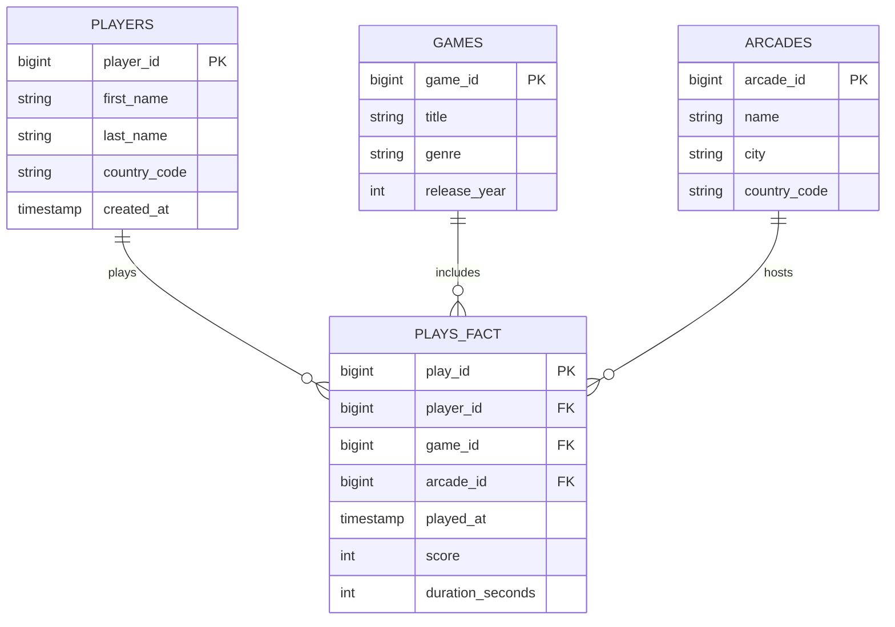

---
# try also 'default' to start simple
theme: ../slidev-theme-soma
# some information about your slides (markdown enabled)
title: Comment choisir sa base de données
info: |
  ## Comment choisir sa base de données
  Besoins, performances & scalabilité
# apply UnoCSS classes to the current slide
class: text-center
# https://sli.dev/features/drawing
drawings:
  persist: false
# slide transition: https://sli.dev/guide/animations.html#slide-transitions
transition: fade
# enable MDC Syntax: https://sli.dev/features/mdc
mdc: true
hideInToc: true
---

<div class="flex items-center justify-center">
  <div class="flex flex-col items-end text-right">
    <h1 class="text-4xl font-extrabold text-gray-800 dark:text-white mb-2">Comment choisir sa base de données</h1>
    <h2 class="text-xl font-semibold text-gray-800 dark:text-gray-300">
      Besoins, performances & scalabilité
    </h2>
    <span class="text-lg font-bold text-gray-700 dark:text-gray-400 mt-4">
      Hugues GAILLARD - Novembre 2025
    </span>
  </div>
  <div style="margin-bottom: 128px;">
      <Compass />
  </div>
</div>

<div style="position: absolute; right: 2rem; bottom: 2rem;">
  
</div>

<!-- <div @click="$slidev.nav.next" class="mt-12 py-1" hover:bg="white op-10">
  Press Space for next page <carbon:arrow-right />
</div> -->

<!--
Bon alors déjà, on ne choisit pas vraiment une base de données mais plutot un système de gestion de base de données (SGBD) qui implémente un certain modèle de données (relationnel, document, graphe, clé-valeur, etc).
-->

---
layout: two-cols
layoutClass: gap-16
hideInToc: true
---

# Au sommaire

Dans cette Masterclass, nous allons explorer les différentes bases de données et leurs spécificités.

<div style="margin: auto; width: 250px;">
  <Compass />
</div>

À la fin de cette heure, vous aurez une culture & une grille de lecture claire pour faire des choix éclairés et justifiés.

::right::

<Toc text-sm minDepth="1" maxDepth="2" />

---
layout: center
---

# Tour d'horizon

---
hideInToc: true
---

# Un peu d'histoire

<style scoped>
.progress-bar {
  position: absolute;
  top: 2.8rem;
  left: 6rem;
  right: 6rem;
  height: 6px;
  z-index: 0;
}

.progress-bar::before {
  content: '';
  position: absolute;
  top: 0;
  left: 0;
  height: 100%;
  background: linear-gradient(to right, var(--soma-pink), var(--soma-blue));
  width: 0%;
  transition: width 0.5s ease-out;
  box-shadow: 0 0 28px rgba(129, 129, 129, 0.67);
}

.progress-bar.step-1::before { width: 0%; }
.progress-bar.step-2::before { width: 0%; }
.progress-bar.step-3::before { width: 20%; }
.progress-bar.step-4::before { width: 40%; }
.progress-bar.step-5::before { width: 60%; }
.progress-bar.step-6::before { width: 80%; }
.progress-bar.step-7::before { width: 100%; }

/* Custom v-click transition with fade and slide-up effect */
.slidev-vclick-target {
  transition: opacity 0.5s ease-out, transform 0.5s ease-out;
}

.slidev-vclick-hidden {
  opacity: 0;
  transform: translateY(20px);
}
</style>

<div class="flex items-start justify-between gap-4 relative pt-12 pb-8 px-8">
  <!-- Continuous horizontal gradient bar -->
  <div
    class="progress-bar"
    :class="{
      'step-1': $clicks === 0,
      'step-2': $clicks === 1,
      'step-3': $clicks === 2,
      'step-4': $clicks === 3,
      'step-5': $clicks === 4,
      'step-6': $clicks === 5,
      'step-7': $clicks >= 6,
    }"
  ></div>

  <!-- 1956 on invente les disques durs, 8 ans après database chez les militaires pour désigner une collection d'informations partagées par différents utilisateurs d'un système d'informations. 1983 ils inventent internet -->
  <div v-click class="flex flex-col items-center flex-1 z-10">
    <div class="w-6 h-6 rounded-full bg-white border-4 border-[var(--soma-blue)] dark:border-gray-800 shadow-lg -mt-3"></div>
    <div class="mt-4 font-bold text-lg">1964</div>
    <div class="mt-2 text-sm text-gray-700 dark:text-gray-300 text-center px-2">Apparition du terme "data base" dans l'US Navy/DARPA</div>
      
  </div>

  <!-- 1970: Edgar Frank Cobb, il publie un article décrivant le modèle relationnel. Naissance du SQL chez IBM avec le projet System R. Il recevra le prix Turing, plus haute distinction en informatique, en 1981 -->
  <div v-click class="flex flex-col items-center flex-1 z-10">
    <div class="w-6 h-6 rounded-full bg-white border-4 border-[var(--soma-blue)] dark:border-gray-800 shadow-lg -mt-3"></div>
    <div class="mt-4 font-bold text-lg">1970</div>
    <div class="mt-2 text-sm text-gray-700 dark:text-gray-300 text-center px-2">Modèle relationnel d'E. F. Codd (IBM), naissance du SQL</div>
      
  </div>

  <!-- 1972: Rudolf Bayer, Edward M. McCreight qui inventent chez Boing l'arbre B qui est encore aujourd'hui utilisé dans énormément de moteurs de bases de données.  -->
  <div v-click class="flex flex-col items-center flex-1 z-10">
    <div class="w-6 h-6 rounded-full bg-white border-4 border-[var(--soma-blue)] dark:border-gray-800 shadow-lg -mt-3"></div>
    <div class="mt-4 font-bold text-lg">1972</div>
    <div class="mt-2 text-sm text-gray-700 dark:text-gray-300 text-center px-2">B-tree (Rudolf Bayer) chez Boeing</div>
      
  </div>

  <!-- Event 4 -->
  <div v-click class="flex flex-col items-center flex-1 z-10">
    <div class="w-6 h-6 rounded-full bg-white border-4 border-[var(--soma-blue)] dark:border-gray-800 shadow-lg -mt-3"></div>
    <div class="mt-4 font-bold text-lg">1977</div>
    <div class="mt-2 text-sm text-gray-700 dark:text-gray-300 text-center px-2">Naissance d'Oracle</div>
      
  </div>

  <!-- Event 5 -->
  <div v-click class="flex flex-col items-center flex-1 z-10">
    <div class="w-6 h-6 rounded-full bg-white border-4 border-[var(--soma-blue)] dark:border-gray-800 shadow-lg -mt-3"></div>
    <div class="mt-4 font-bold text-lg">1998</div>
    <div class="mt-2 text-sm text-gray-700 dark:text-gray-300 text-center px-2">Apparition du terme NoSQL</div>
      
  </div>

  <!-- Event 6 -->
  <div v-click class="flex flex-col items-center flex-1 z-10">
    <div class="w-6 h-6 rounded-full bg-white border-4 border-[var(--soma-blue)] dark:border-gray-800 shadow-lg -mt-3"></div>
    <div class="mt-4 font-bold text-lg">2012</div>
    <div class="mt-2 text-sm text-gray-700 dark:text-gray-300 text-center px-2">Création de Snowflake</div>
      
  </div>
</div>

---
layout: quote
hideInToc: true
---

# Law of the instrument

<div class="flex items-center justify-between gap-8 h-[400px]">
  <div class="flex-1 p-6 text-left flex flex-col justify-center">
    <blockquote class="italic text-gray-700 dark:text-gray-200 mb-4">
      <span class="text-2xl">
        “It is tempting, if the only tool you have is a hammer, to treat everything as if it were a nail.”
      </span>
    </blockquote>
    <div class="text-right text-lg text-gray-500 dark:text-gray-400">
      Abraham Maslow, 1966<br>
      <span class="text-base">Law of the instrument</span>
    </div>
  </div>
  <div class="flex-1 flex justify-center items-center">
    
  </div>
</div>


---

# La jungle des bases de données


<Databases />
<p v-click>
</p>
<p v-click>
</p>
<p v-click>
</p>
<p v-click>
</p>
<p v-click>
</p>

<!--
You can have `style` tag in markdown to override the style for the current page.
Learn more: https://sli.dev/features/slide-scope-style
-->

<!--
Here is another comment.
-->
---
---
# La base de données parfaite ?

<div class="flex flex-col gap-1 items-start text-left text-lg">

<span v-mark.underline.blue v-click="1">- Pour le DBA :</span><span v-click="2"> facile à installer, évolutive, bien documentée...</span>

<span v-mark.underline.blue="3" v-click="3">- Pour les utilisateurs :</span><span v-click="4"> simple à requêter, fiable, rapide...</span>

<span v-mark.underline.blue="5" v-click="5">- Pour la sécurité :</span><span v-click="6"> certifiée, résiliente, chiffrée...</span>

<span v-mark.underline.blue="7" v-click="7">- Pour la direction :</span> <span v-click="8"> économique, supportée, pérenne...</span>

</div>

<div class="mt-8 text-xl font-bold text-center">
<span v-click="9">Est-ce que cette base de données existe ? </span>
<span v-mark.red="10" v-click="10">Non.</span>
</div>

<div class="mt-4 text-lg text-center">
<span v-click="11">Il faut nécessairement faire des </span><span v-mark.box.orange="12" v-click="12">compromis.</span><br>
<span v-click="13">Et pour choisir les bons compromis, il faut d'abord bien comprendre les </span><span v-mark.box.blue="14" v-click="14">besoins.</span>
</div>

<!-- "Il n'y a pas de 'meilleure' base de données, seulement le meilleur outil pour un problème donné." -->

---
layout: center
---

<span class="sub-title-bar">Étape 1</span>

# La nature de la charge de travail

<!-- C'est le "pourquoi ?" On va faire l'analyse des Besoins.
On fait pas de la technique pour de la technique mais pour répondre à un besoin métier.
Et donc on doit se demander quel est l'objectif Business : Quel est le but final du projet ? (Ex: augmenter les ventes grâce à une meilleure connaissance de mes clients, analyser des logs, gérer des utilisateurs).

Et y'a une question primordiale à se poser dès le début :
C'est le profil des Requêtes : Quel type d'opérations sera le plus fréquent ?
C'est dans le jargon les access patterns. -->


---
hideInToc: true
---

# OLTP


**OLTP (Online Transaction Processing)** est conçu pour gérer des transactions en temps réel: exécution rapide de requêtes courtes et fréquentes, typiquement utilisées dans les applications opérationnelles.

- **Forte concurrence** d'utilisateurs effectuant des opérations de lecture et d'écriture simultanément
- **Faible latence** pour assurer une expérience utilisateur fluide
- Données **très normalisées** pour minimiser la redondance et assurer l'intégrité des données


**Exemple :** Un système de réservation de billets d'avion où les utilisateurs effectuent des recherches, réservent des sièges et effectuent des paiements. Chaque action génère une transaction qui doit être traitée rapidement et de manière fiable.

<div class="flex flex-row justify-center items-center gap-8">
  
  
  
</div>


<!--
Notes can also sync with clicks

[click] This will be highlighted after the first click

[click] Highlighted with `count = ref(0)`

[click:3] Last click (skip two clicks)
-->

---
hideInToc: true
---

# OLAP

**OLAP (Online Analytical Processing)** est conçu pour l’analyse de grandes quantités de données. Les bases OLAP permettent d’exécuter des requêtes complexes sans impacter les bases transactionnelles, avec :
- **Requêtes longues et complexes** impliquant des agrégations et des jointures sur de grandes tables
- **Lectures massives** de données historiques pour identifier des tendances et des modèles
- Données **dénormalisées** (schéma en étoile/flocon) pour optimiser les performances des requêtes analytiques

**Exemple :** Un système qui analyse les ventes trimestrielles, les tendances du marché et les performances des produits. Les utilisateurs peuvent exécuter des requêtes complexes pour générer des rapports et des tableaux de bord.

<div class="flex flex-row justify-center items-center gap-8">
  
  
  
</div>

---

# OLTP vs OLAP - Comparaison Technique

| Caractéristique Technique | **OLTP (Transactionnel)** | **OLAP (Analytique)** |
| :--- | :---: | :---: |
| **Objectif Principal** | Enregistrement des transactions | Analyse et aide à la décision |
| **Stockage Physique** | Orienté **Ligne** (Row-Store) | Orienté **Colonne** (Column-Store) |
| **Optimisation I/O** | Écritures et lectures de lignes complètes | Lectures de colonnes spécifiques |
| **Modèle de Données** | **Normalisé** (ex: 3NF) | **Dénormalisé** (ex: Schéma en étoile) |
| **Type de Requêtes** | Simples (INSERT, UPDATE, DELETE, SELECT...) | Complexes (Agrégations, SUM, AVG, GROUP BY) |


---

# Vers l'unification des technos transactionnelles et analytiques

**Gartner Inc.** propose en 2014 le concept de **HTAP (Hybrid Transactional/Analytical Processing)**, qui vise à combiner les capacités transactionnelles et analytiques au sein d'une même architecture logicielle.

<div v-click class="mt-18">
<div class="flex flex-row gap-8 items-center justify-center">
  
  
</div>

Les derniers rachats de 2025 (Neon par Databricks, Crunchy Data par Snowflake) montrent que les acteurs OLAP intègrent de plus en plus des fonctionnalités transactionnelles.
</div>

---
layout: center
---
<span class="sub-title-bar">Étape 2</span>
# Le modèle de données


---

# Les grandes familles de bases de données

<style scoped>
.db-models-grid {
  display: grid;
  grid-template-columns: repeat(auto-fit, minmax(200px, 1fr));
  gap: 16px;
  width: 100%;
  padding: 16px;
}

.sparkly-svg-container {
  position: relative;
  width: 56px;
  height: 56px;

  -webkit-mask-repeat: no-repeat;
  mask-repeat: no-repeat;
  -webkit-mask-position: center;
  mask-position: center;
  -webkit-mask-size: contain;
  mask-size: contain;
}

/* Unique gradients for each database type */
.sparkly-svg-container.relational {
  -webkit-mask-image: url('/db-family/relational.svg');
  mask-image: url('/db-family/relational.svg');
  background-image: linear-gradient(45deg, #4169E1 0%, #1E90FF 50%, #00BFFF 100%);
}

.sparkly-svg-container.graph {
  -webkit-mask-image: url('/db-family/graph.svg');
  mask-image: url('/db-family/graph.svg');
  background-image: linear-gradient(45deg, #9B59B6 0%, #E91E63 50%, #FF1744 100%);
}

.sparkly-svg-container.document {
  -webkit-mask-image: url('/db-family/document.svg');
  mask-image: url('/db-family/document.svg');
  background-image: linear-gradient(45deg, #FF6B35 0%, #FF9E44 50%, #FFC93C 100%);
}

.sparkly-svg-container.key-value {
  -webkit-mask-image: url('/db-family/key-value.svg');
  mask-image: url('/db-family/key-value.svg');
  background-image: linear-gradient(45deg, #2ECC71 0%, #27AE60 50%, #1ABC9C 100%);
}

.sparkly-svg-container.time-series {
  -webkit-mask-image: url('/db-family/time-series.svg');
  mask-image: url('/db-family/time-series.svg');
  background-image: linear-gradient(45deg, #00BCD4 0%, #00ACC1 50%, #0097A7 100%);
}

.sparkly-svg-container.full-text-search {
  -webkit-mask-image: url('/db-family/full-text-search.svg');
  mask-image: url('/db-family/full-text-search.svg');
  background-image: linear-gradient(45deg, #5100ffff 0%, #ff0073ff 50%, #ffa84cff 100%);
}

.sparkly-svg-container.geospatial {
  -webkit-mask-image: url('/db-family/geospatial.svg');
  mask-image: url('/db-family/geospatial.svg');
  background-image: linear-gradient(45deg, #26A69A 0%, #00897B 50%, #00695C 100%);
}

.sparkly-svg-container.vectorial {
  -webkit-mask-image: url('/db-family/vector.svg');
  mask-image: url('/db-family/vector.svg');
  background-image: linear-gradient(45deg, #f06392ff 0%, #bb2444ff 50%, #ea4b8fff 100%);
}

.sparkly-svg-container.hybrid {
  -webkit-mask-image: url('/db-family/hybrid.svg');
  mask-image: url('/db-family/hybrid.svg');
  background-image: linear-gradient(45deg, #0099ffff 0%, #e6199eff 50%, #15d853ff 100%);
}

/* Shimmer with offset timing for each type */
.sparkly-svg-container::after {
  content: '';
  position: absolute;
  z-index: 2;
  mix-blend-mode: screen;
  top: 0;
  left: -200%;
  width: 50%;
  height: 100%;
  background: rgba(255, 255, 255, 0.4);
  transform: skewX(-20deg);
  animation: spark-shimmer 20s infinite linear;
}

/* Offset animation delays for each database type */
.sparkly-svg-container.relational::after {
  animation-delay: -9s;
}

.sparkly-svg-container.graph::after {
  animation-delay: -8s;
}

.sparkly-svg-container.document::after {
  animation-delay: -7s;
}

.sparkly-svg-container.key-value::after {
  animation-delay: -6s;
}

.sparkly-svg-container.time-series::after {
  animation-delay: -5s;
}

.sparkly-svg-container.full-text-search::after {
  animation-delay: -4s;
}

.sparkly-svg-container.vectorial::after {
  animation-delay: -3s;
}

.sparkly-svg-container.geospatial::after {
  animation-delay: -2s;
}

.sparkly-svg-container.hybrid::after {
  animation-delay: -1s;
}

@keyframes spark-shimmer {
  0% { left: -200%; }
  5% { left: 200%; }
  100% { left: 200%; }
}

.db-model {
  display: flex;
  flex-direction: column;
  align-items: center;
  justify-content: center;
  padding: 16px;
  box-shadow: 0 4px 12px rgba(0, 0, 0, 0.1);
  transition: transform 0.3s ease, box-shadow 0.3s ease;
  background-color: var(--elevated-bg);
  border-radius: 12px;
  height: 100%;
}

.db-model:hover {
  transform: translateY(-4px);
  box-shadow: 0 8px 20px rgba(0, 0, 0, 0.15);
}
</style>

<div class="db-models-grid">
  <div class="db-model" v-click>
    Relationnel
    <div class="sparkly-svg-container relational" role="img" aria-label="Relational"></div>
  </div>

  <div class="db-model" v-click>
    Graph
    <div class="sparkly-svg-container graph" role="img" aria-label="Graph"></div>
  </div>

  <div class="db-model" v-click>
    Document
    <div class="sparkly-svg-container document" role="img" aria-label="Document"></div>
  </div>

  <div class="db-model" v-click>
    Clé-Valeur
    <div class="sparkly-svg-container key-value" role="img" aria-label="Clé-Valeur"></div>
  </div>

  <div class="db-model" v-click>
    Séries Temporelles
    <div class="sparkly-svg-container time-series" role="img" aria-label="Séries Temporelles"></div>
  </div>

  <div class="db-model" v-click>
    Recherche plein texte
    <div class="sparkly-svg-container full-text-search" role="img" aria-label="Recherche plein texte"></div>
  </div>

  <div class="db-model" v-click>
    Vectoriel
    <div class="sparkly-svg-container vectorial" role="img" aria-label="Vectoriel"></div>
  </div>

  <div class="db-model" v-click>
    Géospatial
    <div class="sparkly-svg-container geospatial" role="img" aria-label="Géospatial"></div>
  </div>

  <div class="db-model" v-click>
    Hybride
    <div class="sparkly-svg-container hybrid" role="img" aria-label="Hybride"></div>
  </div>
</div>


<!-- 💾 Relationnel (SQL)
Le modèle relationnel est le pilier des bases de données traditionnelles, utilisant des tables structurées avec des lignes et des colonnes pour organiser les données. Il excelle grâce à sa cohérence (ACID compliance), garantissant que les transactions sont traitées de manière fiable. Il est particulièrement adapté aux applications nécessitant une intégrité transactionnelle forte et des relations complexes mais prédéfinies entre les entités.

SGBD Populaires : PostgreSQL, MySQL, Oracle, Microsoft SQL Server.

Use Cases Typiques : Systèmes de gestion de la relation client (CRM), systèmes de planification des ressources d'entreprise (ERP), applications bancaires et financières.

🌐 Graph
Les bases de données Graph modélisent les données sous forme de nœuds (entités), d'arêtes (relations) et de propriétés. Elles sont optimisées pour les requêtes explorant les relations et les chemins entre les données, ce qui est extrêmement difficile à réaliser efficacement avec le modèle relationnel. Le temps de requête reste constant même si le volume total de données augmente, car l'accent est mis sur les connexions locales.

SGBD Populaires : Neo4j, Amazon Neptune, TigerGraph.

Use Cases Typiques : Réseaux sociaux (trouver des amis de ses amis), moteurs de recommandation, détection de fraudes, gestion de connaissances.

📄 Document
Les bases de données Document stockent les données dans des formats flexibles, semi-structurés comme JSON, BSON, ou XML. Elles offrent une grande flexibilité de schéma (schema-less), ce qui les rend idéales pour les données qui évoluent rapidement ou qui ont des structures très variées. Elles permettent souvent des requêtes riches et complexes sur le contenu des documents.

SGBD Populaires : MongoDB, Couchbase, Amazon DynamoDB (peut être utilisé comme base de données de documents).

Use Cases Typiques : Gestion de contenu (catalogues de produits, blogs), profils utilisateurs mobiles, Internet des Objets (IoT).

🔑 Clé Valeur
Les bases de données Clé Valeur sont les plus simples, stockant chaque élément de données comme une paire clé-valeur où la clé est unique. Elles excellent en termes de vitesse et d'évolutivité (scalability), car la récupération des données est un simple lookup direct. Elles sont souvent utilisées pour la mise en cache et le stockage de sessions utilisateur.

SGBD Populaires : Redis, Memcached, Amazon DynamoDB (principalement Clé-Valeur), Riak.

Use Cases Typiques : Caching de données fréquentes, gestion de sessions utilisateur, tableaux de classement en temps réel.

⏱️ Séries Temporelles
Conçues spécifiquement pour gérer des données horodatées qui arrivent dans un ordre chronologique (une série temporelle). Elles sont optimisées pour les opérations d'écriture à haut débit et les requêtes qui analysent des plages de temps (agrégations, moyennes) et permettent une rétention efficace des données. Elles sont cruciales pour l'analyse des tendances et la surveillance.

SGBD Populaires : InfluxDB, Prometheus, TimescaleDB (extension PostgreSQL).

Use Cases Typiques : Surveillance de l'infrastructure et des applications, données de capteurs IoT, suivi des marchés financiers.

🔍 Recherche Plein Texte
Ces bases de données sont spécialisées dans l'indexation et la recherche rapide dans de grandes quantités de texte non structuré. Elles utilisent des techniques d'inversion d'index pour permettre des recherches par mots-clés, des recherches floues, et des classements de pertinence sophistiqués. Elles vont bien au-delà de la simple clause LIKE des bases de données relationnelles.

SGBD Populaires : Elasticsearch, Apache Solr, OpenSearch.

Use Cases Typiques : Moteurs de recherche de sites web et d'applications, agrégation et analyse de logs, catalogues de produits avec facettes.

📏 Vectoriel
Les bases de données Vectoriel stockent des données sous forme de vecteurs numériques (embeddings) qui représentent le sens sémantique de l'objet (texte, image, son). Elles permettent la recherche par similarité (Nearest Neighbor Search) en comparant la "distance" entre les vecteurs. Elles sont au cœur des applications d'Intelligence Artificielle générative.

SGBD Populaires : Pinecone, Milvus, Weaviate, PostgreSQL avec l'extension pgvector.

Use Cases Typiques : Recherche sémantique, systèmes de recommandation basés sur la pertinence du contenu, applications de Retrieval-Augmented Generation (RAG) pour les LLM.

🗺️ Géospatial
Spécialisées dans la gestion et l'interrogation de données géographiques (points, lignes, polygones). Elles offrent des fonctions optimisées pour calculer les distances, déterminer si un point est dans une région (requêtes de proximité), ou effectuer des opérations géométriques complexes. Elles reposent sur des index spatiaux pour des performances optimales.

SGBD Populaires : PostGIS (extension PostgreSQL, très puissant), Esri ArcGIS, MongoDB (avec index 2dsphere).

Use Cases Typiques : Systèmes d'information géographique (SIG), applications de cartographie, services de localisation pour le covoiturage.

🤝 Hybride (Multi-Modèle)
Les bases de données Hybrides ou Multi-Modèles sont conçues pour prendre en charge plusieurs types de modèles de données (document, graph, clé-valeur, etc.) dans une seule base de données intégrée. Cela permet aux développeurs de choisir le meilleur modèle pour chaque besoin sans avoir à gérer plusieurs systèmes de bases de données séparés. Elles simplifient l'architecture en fournissant une plateforme unifiée.

SGBD Populaires : ArangoDB, Amazon DynamoDB, MarkLogic, et PostgreSQL qui, avec ses extensions, est souvent considéré comme multi-modèle.

Use Cases Typiques : Applications nécessitant à la fois des relations complexes (graph) et une flexibilité de schéma (document) comme des catalogues de produits riches ou des applications d'entreprise intégrées. -->

---

# ACID vs BASE

De quel type de garanties ai-je besoin pour mes données ?

<div v-click class="flex flex-row items-center justify-between gap-8">
  <div class="flex-1 text-left text-lg">
    <span class="font-bold text-green-400" >ACID</span><br>
    <ul class="list-disc list-inside mt-2">
      <li><strong>A</strong>tomicité</li>
      <li><strong>C</strong>ohérence</li>
      <li><strong>I</strong>solation</li>
      <li><strong>D</strong>urabilité</li>
    </ul>
    <div class="mt-4">
      <span class="text-gray-700 dark:text-gray-300">Garantit que les transactions sont traitées de manière fiable.</span>
    </div>
  </div>
  <div class="flex-1 flex justify-center items-center">
    

  <style scoped>
  @keyframes acidBaseWiggle {
    0% { transform: rotate(0deg); }
    2% { transform: rotate(-8deg); }
    4% { transform: rotate(8deg); }
    7% { transform: rotate(-6deg); }
    9% { transform: rotate(6deg); }
    12% { transform: rotate(-4deg); }
    14% { transform: rotate(4deg); }
    16% { transform: rotate(0deg); }
    100% { transform: rotate(0deg); }
  }
  .acid-base-wiggle {
    animation: acidBaseWiggle 15s infinite;
  }
  </style>
  </div>
  <div class="flex-1 text-left text-lg">
    <span class="font-bold text-blue-400">BASE</span><br>
    <ul class="list-disc list-inside mt-2">
      <li><strong>B</strong>asically <strong>A</strong>vailable</li>
      <li><strong>S</strong>oft state</li>
      <li><strong>E</strong>ventually consistent</li>
    </ul>
    <div class="mt-4">
      <span class="text-gray-700 dark:text-gray-300">Favorise la disponibilité et la partition des données, souvent au détriment de la cohérence immédiate.</span>
    </div>
  </div>
</div>

<!--
A	Atomicité	Tout ou rien : Une transaction est traitée comme une seule unité. Soit toutes les étapes réussissent, soit aucune ne s'applique.	Transfert d'argent : Si vous transférez 100€ du Compte A au Compte B, il faut à la fois débiter A et créditer B. Si le débit réussit mais que le crédit échoue (panne), l'atomicité annule le débit, laissant A et B dans leur état initial.
C	Cohérence	Règles respectées : La transaction fait passer la base de données d'un état valide à un autre. Toutes les règles (contraintes d'intégrité) sont maintenues.	Solde minimal : La règle est que le solde d'un compte ne peut être négatif. Si une tentative de retrait de 500€ sur un compte n'ayant que 300€ est faite, la cohérence rejette la transaction pour maintenir la règle.
I	Isolation	Transactions séparées : Plusieurs transactions simultanées ne s'interfèrent pas. C'est comme si elles s'exécutaient l'une après l'autre.	Achat du dernier article : Deux clients tentent d'acheter le dernier article en même temps. L'isolation garantit qu'une seule transaction sera validée en premier, laissant un stock de 0 pour l'autre, empêchant ainsi une double vente.
D	Durabilité	Modifications permanentes : Une fois qu'une transaction est validée (réussie), les modifications sont permanentes et survivent à toute panne du système (arrêt, redémarrage, etc.).	Sauvegarde de commande : Vous validez une commande en ligne. La durabilité assure que même si le serveur tombe en panne immédiatement après avoir affiché la confirmation, votre commande et votre paiement resteront enregistrés dans la base de données.

B	Basically Available (Essentiellement Disponible)	Toujours accessible : Le système garantit une réponse à chaque requête, même en cas de défaillance d'un nœud (serveur). La disponibilité est la priorité, même si la réponse n'est pas la plus récente.	Réseaux sociaux : Un réseau social doit rester fonctionnel à tout moment. Si un serveur qui stocke la dernière version d'un post est en panne, le système peut servir une version légèrement plus ancienne à certains utilisateurs plutôt que de ne rien afficher.
A	Soft State (État Mou)	Pas d'état fixe immédiat : L'état d'un système peut changer même sans nouvelle entrée (transaction validée), souvent en raison du temps nécessaire à la propagation des données entre les nœuds.	Mise à jour distribuée : Une information mise à jour sur un serveur ne sera pas immédiatement répercutée sur tous les autres serveurs. Le système est dans un état intermédiaire "mou" pendant la synchronisation.
E	Eventually Consistent (Cohérence Éventuelle)	Finira par être cohérent : Si le système reçoit des mises à jour, il atteindra un état cohérent (où toutes les copies de la donnée sont identiques) après un certain temps, s'il n'y a plus de nouvelles mises à jour.	Compteur de "J'aime" : Lorsque vous cliquez sur "J'aime" sur une publication, le compteur augmente immédiatement sur votre serveur local (Haute Disponibilité). Cependant, le compteur peut mettre quelques secondes ou minutes à se mettre à jour sur les serveurs des autres utilisateurs. Finalement, le nombre sera le même pour tout le monde.

Un théorème est à l'œuvre ici : le théorème CAP (Consistence, Availability, Partition tolerance). Il stipule qu'un système distribué ne peut garantir que deux des trois propriétés suivantes simultanément : cohérence, disponibilité et tolérance aux partitions. -->


---
hideInToc: true
---

# SQL, NoSQL et NewSQL

<div class="flex flex-col gap-6 text-lg">

<div v-click class="flex items-center gap-4">
  
  <span>
    <span class="font-bold text-blue-700">SQL</span> &mdash; <span class="italic">Relationnel classique</span><br>
    <span class="text-gray-700 dark:text-gray-300">
      <strong>Exemples :</strong> PostgreSQL, MySQL, Oracle, SQL Server<br>
      <strong>Garanties :</strong> <span class="font-mono">ACID</span> (Atomicité, Cohérence, Isolation, Durabilité)<br>
      <strong>Scalabilité :</strong> <span class="font-mono">Verticale</span> (scale-up)<br>
      <strong>Langage :</strong> SQL standardisé
    </span>
  </span>
</div>

<div v-click class="flex items-center gap-4">
  
  <span>
    <span class="font-bold text-orange-700">NoSQL</span> &mdash; <span class="italic">Non relationnel</span><br>
    <span class="text-gray-700 dark:text-gray-300">
      <strong>Exemples :</strong> MongoDB, Redis, Cassandra, Neo4j<br>
      <strong>Garanties :</strong> <span class="font-mono">BASE</span> (Basically Available, Soft state, Eventually consistent)<br>
      <strong>Scalabilité :</strong> <span class="font-mono">Horizontale</span> (scale-out)<br>
      <strong>Langage :</strong> Pas de standard universel
    </span>
  </span>
</div>

<div v-click class="flex items-center gap-4">
  
  <span>
    <span class="font-bold text-green-700">NewSQL</span> &mdash; <span class="italic">Relationnel scalable</span><br>
    <span class="text-gray-700 dark:text-gray-300">
      <strong>Exemples :</strong> CockroachDB, YugabyteDB, Google Spanner<br>
      <strong>Garanties :</strong> <span class="font-mono">ACID</span> + <span class="font-mono">Scalabilité horizontale</span><br>
      <strong>Langage :</strong> SQL standardisé
    </span>
  </span>
</div>

</div>


---
layout: center
---

<span class="sub-title-bar">Étape 3</span>
# Les contraintes

---

# La scalabilité et le théorème CAP


<CAPTheorem />
<span v-click></span>
<span v-click></span>
<span v-click></span>
<div v-click>
<span style="position: absolute; top: 295px; left: 40px;">
  Système bancaire
</span>
<Arrow x1="200" y1="310" x2="430" y2="310" />
</div>

<div v-click>
<span style="position: absolute; top: 295px; left: 710px;">
  Serveur DNS
</span>
<Arrow x1="700" y1="310" x2="550" y2="310" />
</div>

<div v-click>
<span style="position: absolute; top: 235px; left: 710px;">
  PostgreSQL
</span>
<Arrow x1="700" y1="250" x2="510" y2="250" />
</div>

---
hideInToc: true
---

# Scalabilité verticale vs horizontale

<Scalability />


---

# Partitionnement (sharding) vs Réplication


---

# L'écosystème & l'expertise

Avant de choisir une base de données, il est crucial d'évaluer son écosystème de travail (interne) et son écosystème externe.
<div class="flex flex-row gap-12 items-start justify-between">
  <div v-click class="flex-1">
    <span class="font-bold text-lg mb-2 block">Écosystème Interne :</span>
    <ul class="list-disc list-inside text-left">
      <li>Quels systèmes de bases de données sont déjà en place ?</li>
      <li>Compétences de l'équipe (et évaluer si formation nécessaire)</li>
      <li>Compatibilité avec les outils existants</li>
      <li>Coût de migration si applicable</li>
      <li>...</li>
    </ul>
  </div>
  <div v-click class="flex-1">
    <span class="font-bold text-lg mb-2 block">Écosystème Externe :</span>
    <ul class="list-disc list-inside text-left">
      <li>Quel niveau de support attendre ? (qu'il soit commercial ou open-source)</li>
      <li>Quel est l'état de la documentation et des ressources <strong>aujourd'hui</strong> ?</li>
      <li>Éviter l'adoption de technologies trop récentes / exotiques / niches</li>
      <li>...</li>
    </ul>
  </div>
</div>


---

# Composer avec plusieurs bases de données

<table class="text-base">
  <thead>
    <tr>
      <th>Stratégie</th>
      <th>Description</th>
      <th>Scénario d'Usage</th>
      <th>Nom d'outils</th>
    </tr>
  </thead>
  <tbody>
    <tr v-click>
      <td><strong>ETL (Extract, Transform, Load)</strong></td>
      <td>Données extraites de la source, transformées (nettoyage, agrégation) puis chargées dans la cible (Data Warehouse/Snowflake).</td>
      <td>Chargement par lots (batch) : une fois par jour par exemple, pour des analyses qui ne nécessitent pas une fraîcheur en temps réel.</td>
      <td>Talend, Informatica, Pentaho</td>
    </tr>
    <tr v-click>
      <td><strong>ELT (Extract, Load, Transform)</strong></td>
      <td>Données chargées brutes dans la cible (souvent un Data Lake ou Data Warehouse moderne) et la transformation a lieu après le chargement, exploitant la puissance de calcul du Data Warehouse.</td>
      <td>Préférence Cloud/Big Data : flexible, tire parti du stockage/puissance de calcul du cloud.</td>
      <td>dbt, Fivetran, Matillion, Airbyte</td>
    </tr>
    <tr v-click>
      <td><strong>CDC (Change Data Capture)</strong></td>
      <td>Seules les modifications sont capturées depuis la base source et appliquées à la base cible en quasi-temps réel.</td>
      <td>Faible Latence : Nécessaire lorsque les données analytiques doivent être très à jour, minimisant l'impact sur la source.</td>
      <td>Debezium, StreamSets, Kafka Connect</td>
    </tr>
  </tbody>
</table>

---

# Dette technique liée aux bases de données

La dette technique commence dès le choix de la base de données.

Le piège le plus redoutable : le **Vendor lock-in** et les **spécificités** techniques (SQL non ANSI, etc.).

Privilégier des formats **ouverts** et **standards** (SQL ANSI, ODBC/JDBC, Parquet) pour minimiser les risques.

Bien concevoir le **modèle de données** pour éviter des migrations coûteuses.

Concevoir des abstractions logicielles pour isoler la logique métier des spécificités de la base de données (un ORM peut aider).

<div class="flex flex-row gap-8 items-center justify-center">
  
  
</div>


---
layout: center
---

<span class="sub-title-bar">Étape 4</span>
# Benchmarker *mon* cas d'usage


---
hideInToc: true
---

# Définir ses critères de performance

<div class="flex flex-row items-start justify-between gap-8 mt-16">
  <div class="flex-1">
    <ul>
      <li>Définir des objectifs clairs : quoi mesurer et sous quel scénario</li>
      <li>Scénarios d'usage concrets en imitant les access patterns et la volumétrie</li>
      <li>Latence (p95, p99), Débit (TPS, QPS)</li>
      <li>Coût (infrastructure, licences, maintenance)</li>
      <li>Garder en tête les limites de son approche</li>
    </ul>
  </div>
  <div class="flex-1 flex justify-end items-center">
    
  </div>
</div>

<!--
ex: latence sous charge, scalabilité horizontale... On ne pourra PAS faire un benchmark exhaustif, c'est impossible.
Peut etre que scenario avec 1 seule instance fonctionne pour A mais scalabilité mal implémentée donc scale moins bien... -->

---
hideInToc: true
---

# Rappels de statistiques

<ol v-click>
  <li>Moyenne (mean) : somme des valeurs divisée par le nombre de valeurs</li>
  <li>Médiane (median) : valeur centrale lorsque les données sont triées</li>
  <li>Percentile (p95, p99) : valeur en dessous de laquelle se trouve un certain pourcentage des données</li>
  <li>Écart-type (standard deviation) : mesure de la dispersion des données autour de la moyenne</li>
</ol>

<span v-click>Combien d'exécutions pour un benchmark fiable ?</span>
<div v-click>

$$
\begin{aligned}
n=\left(\frac{Z \cdot \sigma}{E}\right)^2
\end{aligned}
$$

avec $Z$ la valeur associée au niveau de confiance souhaité, $σ$ l'écart-type estimé des temps de réponse, et $E$ la marge d'erreur acceptable.
</div>
<div v-click>
Exemple, si Z=1.96 (95% de confiance), σ=10ms, E=5ms, alors, on aura :

$$
\begin{aligned}
n=\left(\frac{1.96 \cdot 10}{5}\right)^2=15
\end{aligned}
$$

</div>

<!-- Disgression : note des restaurants sur Google Maps -->

---
hideInToc: true
---

# Hyperfine

Pour simplifier le processus de benchmark, on peut utiliser des outils comme Hyperfine qui permettent d'automatiser les tests de performance.

Installation:

```sh
apt install hyperfine
```

Utilisation de base:
```sh
hyperfine "commande_a_tester" "autre_commande"
```

---

# Cas pratique : SOMA'rcade
<div class="flex flex-row items-center justify-between gap-12">
  <div class="w-2/3 text-lg leading-relaxed">
    <p v-click>
      <span class="font-black">
        <span style="color: var(--soma-pink);">SOMA</span><span style="color: var(--soma-blue);">rcade</span>
      </span>
      est une entreprise qui gère un réseau de salles d’arcade réparties dans plusieurs villes et pays.
    </p>
    <p v-click><span>Elle enregistre les parties jouées par chaque joueur sur différents jeux, en suivant le <span class="font-semibold">score</span>, la <span class="font-semibold">durée</span> et la <span class="font-semibold">date</span> de chaque session.</span></p>
    <p v-click>Le système permet ainsi d’analyser la <span class="italic">fréquentation</span>, les <span class="italic">performances des joueurs</span> et la <span class="italic">popularité des jeux</span>.</p>
    <br />
    <p v-click>
      <span class="inline-block align-middle" style="font-size: 1.5em; color: var(--soma-blue);">
        <svg width="32" height="32" viewBox="0 0 32 32" fill="none" style="vertical-align: middle;">
          <path d="M4 16h20M18 10l6 6-6 6" stroke="currentColor" stroke-width="3" stroke-linecap="round" stroke-linejoin="round"/>
        </svg>
      </span>
      Nous allons benchmarker Postgres vs Clickhouse pour mettre en lumière les différences de performance. Dans la pratique, cela n'a pas d'intérêt (OLAP vs OLTP).
    </p>
  </div>
  <div class="w-1/3 flex justify-center items-center h-full">
    
  </div>
</div>

---
layout: two-cols
hideInToc: true
---

# Cas pratique : Modélisation des données

Premier objectif : identifier les entités principales et leurs relations:
<ul>
  <li v-click>Joueur (<code>players</code>) : nom, pays, etc.</li>
  <li v-click>Jeu (<code>games</code>) : titre, genre, etc.</li>
  <li v-click>Borne d'arcade (<code>arcades</code>) : nom de la borne, ville et pays, ...</li>
  <li v-click>Session de jeu (<code>plays_fact</code>) : joueur, jeu, score, durée, date, ...</li>
</ul>

::right::

<div v-click>
Exemple de modélisation 3NF (normalisation) :

```sql
CREATE TABLE players (
    player_id bigint GENERATED ALWAYS AS IDENTITY PRIMARY KEY,
    first_name text NOT NULL,
    last_name text NOT NULL,
    country_code char(2) NOT NULL,
    created_at timestamptz NOT NULL DEFAULT now()
);
```
</div>

<div v-click>
Clé primaire : player_id

Chaque attribut dépend directement de player_id (pas de dépendance transitive ni partielle).

`country_code` n’est pas dérivable des autres colonnes → pas de redondance.

La table ne présente ni de dépendance partielle, ni de dépendance transitive.

🧠 Le schéma est donc en 3e forme normale (3NF)
</div>

---
hideInToc: true
---

# Cas pratique : Schéma complet

<div class="flex items-center justify-center h-full">
  <div class="flex flex-col items-center justify-center w-full">


```mermaid { scale: 0.6 }
erDiagram
  PLAYERS {
    bigint player_id PK
    string first_name
    string last_name
    string country_code
    timestamp created_at
  }

  GAMES {
    bigint game_id PK
    string title
    string genre
    int release_year
  }

  ARCADES {
    bigint arcade_id PK
    string name
    string city
    string country_code
  }

  PLAYS_FACT {
    bigint play_id PK
    bigint player_id FK
    bigint game_id FK
    bigint arcade_id FK
    timestamp played_at
    int score
    int duration_seconds
  }

  PLAYERS  ||--o{ PLAYS_FACT : plays
  GAMES    ||--o{ PLAYS_FACT : includes
  ARCADES  ||--o{ PLAYS_FACT : hosts
```

  </div>
</div>

---
hideInToc: true
---

# Cas pratique : Démarrer Postgres & ClickHouse

::code-group

```sh [Commande Docker pour démarrer Postgres]
docker run -d --name postgres \
  -e POSTGRES_PASSWORD=secretpw \
  -p 5432:5432 \
  -v /data/pgdata:/var/lib/postgresql \
  -v ./output:/output \
  postgres:18.0
```

```sh [Commande Docker pour démarrer ClickHouse]
docker run -d --name clickhouse \
  --ulimit nofile=262144:262144 \
  -e CLICKHOUSE_PASSWORD=secretpw \
  -p 8123:8123 -p 9000:9000 \
  -v /data/ch_data:/var/lib/clickhouse \
  -v /data/ch_logs:/var/log/clickhouse-server \
  clickhouse/clickhouse-server:25.9
```
::

<Callout v-click type="warning">
  <strong>Attention&nbsp;:</strong> utilisez des <code>bind mounts</code> (option <code>-v</code>) ou des <code>named volumes</code> mais surtout pas l'OverlayFS de Docker (<em>writable layer</em>), qui dégrade fortement les performances d'I/O.
</Callout>

<Callout v-click type="info">
  <strong>Info&nbsp;:</strong> Ne pas oublier qu'il est possible d'ajouter des limites CPU ou RAM facilement avec Docker !<br>
  <span class="font-mono text-blue-700">Exemples : <code>--cpus="1.5"</code> ou <code>--memory="4g"</code></span>
</Callout>


---
hideInToc: true
---

# Cas pratique : Générons des données fictives

<div class="flex flex-row items-center justify-between gap-12">
  <div class="flex flex-col items-center justify-center w-1/2" style="min-height: 420px;">
  <div v-click>
    <div class="text-lg mb-4">
      Nous allons utiliser <strong>Fakelake</strong>, un outil <strong style="color: var(--soma-blue)">SOMA</strong> open-source de génération de données massives :
    </div>
    
    </div>
    <span v-click>Le process est simple :</span>
    <ol class="list-decimal list-inside text-left mt-4">
      <li v-click>Définir le schéma des données à générer (colonnes, types, contraintes)</li>
      <li v-click>Spécifier le format de sortie (CSV, Parquet, etc.) et le nombre de lignes</li>
      <li v-click>Lancer la génération et récupérer les fichiers</li>
    </ol>
  </div>
  <div v-click="3" class="w-1/2">

````md magic-move {lines:true}
```yaml
columns:
  - name: first_name
    provider: Person.fname

  - name: last_name
    provider: Person.lname

  - name: country_code
    provider: Constant.string
    data: ["US", "FR", "DE", "IT", "ES"]

  - name: created_at
    provider: Random.Date.date
    format: "%Y-%m-%d"
    after: 2002-02-15
    before: 2025-10-30
```
```yaml
columns:
  - name: first_name
    provider: Person.fname

  - name: last_name
    provider: Person.lname

  - name: country_code
    provider: Constant.string
    data: ["US", "FR", "DE", "IT", "ES"]

  - name: created_at
    provider: Random.Date.date
    format: "%Y-%m-%d"
    after: 2002-02-15
    before: 2025-10-30

info:
  output_name: players
  output_format: csv
  rows: 1_000_000
  seed: 42
```
````
  </div>
</div>

---
hideInToc: true
---

# Cas pratique : Générons des données fictives

<div class="flex flex-row gap-8 items-start justify-center">
  <div class="w-2/5">

```yaml
columns:
  - name: first_name
    provider: Person.fname

  - name: last_name
    provider: Person.lname

  - name: country_code
    provider: Constant.string
    data: ["US", "FR", "DE", "IT", "ES"]

  - name: created_at
    provider: Random.Date.date
    format: "%Y-%m-%d"
    after: 2002-02-15
    before: 2025-10-30

info:
  output_name: players
  output_format: csv
  rows: 1_000_000
  seed: 42
```

  </div>
  <div class="w-3/5">
Génération:

```sh
time fakelake generate 'players.yml'
[INFO  fakelake::generate] File from path "/players.yml" generated.
fakelake generate   0,72s user 0,03s system 96% cpu 0,777 total
```


  Exemple de sortie CSV :
```csv
first_name,last_name,country_code,created_at
CAROL-ANNE,VIEILLY,ES,2002-04-11
WINSTON,BERTOLO,FR,2021-04-06
MENOUAR,IMOUZA,ES,2020-02-09
CLÉLYA,LALAISON,FR,2005-06-04
LYESS,THARSIS,DE,2010-06-18
EMMA-LOU,GIORDANO,ES,2008-01-08
MATTHIEU,DUCOLOMBIER,US,2016-09-27
LAURY-ANNE,DEJONCKHEERE,IT,2023-05-27
BRUNO,ROE,ES,2012-07-02
MARIE-NADINE,BLANCHARDIE,US,2023-12-04
ZUZANNA,JARNOUX,DE,2010-08-11
DOAN,BOHLER,US,2020-02-08
```
  </div>
</div>

---
hideInToc: true
---

# Cas pratique : Importer les données dans Postgres

::code-group

```sql [players.sql]
-- Insertion des données dans la table players
COPY players(
    first_name,
    last_name,
    country_code,
    created_at
)
FROM '/output/players.csv' DELIMITER ',' CSV HEADER;
```
```sql [games.sql]
-- Insertion des données dans la table games
COPY games(title, genre, release_year)
FROM '/output/games.csv' DELIMITER ',' CSV HEADER;
```
```sql [arcades.sql]
-- Insertion des données dans la table arcades
COPY arcades(name, city, country_code)
FROM '/output/arcades.csv' DELIMITER ',' CSV HEADER;
```
```sql [plays_fact.sql]
-- Insertion des données dans la table plays_fact
COPY plays_fact(
    play_id,
    player_id,
    game_id,
    arcade_id,
    played_at,
    score,
    duration_seconds
)
FROM '/output/plays_fact.csv' DELIMITER ',' CSV HEADER;
```
::

<Callout v-click type="info">
  <strong>Info&nbsp;:</strong> Je vous conseille de <code>DROP</code> les contraintes de clés étrangères avant d'importer les données, puis de les recréer après l'import.
</Callout>

---
hideInToc: true
---

# Cas pratique : Modéliser pour ClickHouse


<div class="flex flex-row gap-8 items-start justify-center">
  <div class="w-1/2">

````md magic-move
```sql [Create table ClickHouse]
-- Denormalized plays table
CREATE TABLE plays_wide ()
```
```sql [Create table ClickHouse]
-- Denormalized plays table
CREATE TABLE plays_wide (
    played_at DateTime64(3) NOT NULL,
    player_id UInt64,
    player_first_name LowCardinality(String),
    player_last_name LowCardinality(String),
    player_country FixedString(2),
    game_id UInt64,
    game_title LowCardinality(String),
    genre LowCardinality(String),
    arcade_id UInt64,
    arcade_name LowCardinality(String),
    arcade_city LowCardinality(String),
    arcade_country FixedString(2),
    score UInt32,
    duration_seconds UInt16
);
```
```sql [Create table ClickHouse]
-- Denormalized plays table
CREATE TABLE plays_wide (
    played_at DateTime64(3) NOT NULL,
    player_id UInt64,
    player_first_name LowCardinality(String),
    player_last_name LowCardinality(String),
    player_country FixedString(2),
    game_id UInt64,
    game_title LowCardinality(String),
    genre LowCardinality(String),
    arcade_id UInt64,
    arcade_name LowCardinality(String),
    arcade_city LowCardinality(String),
    arcade_country FixedString(2),
    score UInt32,
    duration_seconds UInt16
) ENGINE = MergeTree() PARTITION BY toYYYYMM(played_at)
ORDER BY (game_id, played_at, player_id);
```
````

</div>
  <div class="w-1/2">

````md magic-move
```sql
INSERT INTO plays_wide ()
```
```sql
INSERT INTO plays_wide
SELECT f.played_at,
    toUInt64(f.player_id) AS player_id,
    p.first_name AS player_first_name,
    p.last_name AS player_last_name,
    p.country_code AS player_country,
    toUInt64(f.game_id) AS game_id,
    g.title AS game_title,
    g.genre AS genre,
    toUInt64(f.arcade_id) AS arcade_id,
    a.name AS arcade_name,
    a.city AS arcade_city,
    a.country_code AS arcade_country,
    toUInt32(f.score) AS score,
    toUInt16(f.duration_seconds) AS duration_seconds;
```
```sql
INSERT INTO plays_wide
SELECT ...
FROM postgresql(
        'postgres:5432',
        'postgres',
        'plays_fact',
        'postgres',
        'secretpw'
    ) AS f
    INNER JOIN postgresql(
        'postgres:5432',
        'postgres',
        'players',
        'postgres',
        'secretpw'
    ) AS p ON p.player_id = f.player_id
    INNER JOIN postgresql(
        'postgres:5432',
        'postgres',
        'games',
        'postgres',
        'secretpw'
    ) AS g ON g.game_id = f.game_id
    INNER JOIN postgresql(
        'postgres:5432',
        'postgres',
        'arcades',
        'postgres',
        'secretpw'
    ) AS a ON a.arcade_id = f.arcade_id;
```
```sql
INSERT INTO plays_wide
SELECT f.played_at,
    toUInt64(f.player_id) AS player_id,
    p.first_name AS player_first_name,
    p.last_name AS player_last_name,
    p.country_code AS player_country,
    toUInt64(f.game_id) AS game_id,
    g.title AS game_title,
    g.genre AS genre,
    toUInt64(f.arcade_id) AS arcade_id,
    a.name AS arcade_name,
    a.city AS arcade_city,
    a.country_code AS arcade_country,
    toUInt32(f.score) AS score,
    toUInt16(f.duration_seconds) AS duration_seconds
FROM postgresql(
        'postgres:5432',
        'postgres',
        'plays_fact',
        'postgres',
        'secretpw'
    ) AS f
    INNER JOIN postgresql(
        'postgres:5432',
        'postgres',
        'players',
        'postgres',
        'secretpw'
    ) AS p ON p.player_id = f.player_id
    INNER JOIN postgresql(
        'postgres:5432',
        'postgres',
        'games',
        'postgres',
        'secretpw'
    ) AS g ON g.game_id = f.game_id
    INNER JOIN postgresql(
        'postgres:5432',
        'postgres',
        'arcades',
        'postgres',
        'secretpw'
    ) AS a ON a.arcade_id = f.arcade_id;
```
````

  </div>
</div>
---
hideInToc: true
---

# Cas pratique : Requête type transactionnelle (OLTP)

Nous voulons trouver le dernier score d'un joueur spécifique pour un jeu donné. Sollicitation de lectures rapides et ciblées (index seek, B-Tree).
<div v-click class="flex flex-row gap-8 items-start justify-center">
  <div class="w-1/2">

```sql [Postgres]
SELECT f.score,
    f.played_at
FROM plays_fact AS f
WHERE f.player_id = $1
    AND f.game_id = $2
ORDER BY f.played_at DESC
LIMIT 1;
```

  </div>
  <div class="w-1/2">

```sql [ClickHouse]
SELECT score,
    played_at
FROM plays_wide
WHERE player_id = { player_id :UInt64 }
    AND game_id = { game_id :UInt64 }
ORDER BY played_at DESC
LIMIT 1;
```

  </div>
</div>

---
hideInToc: true
---

# Cas pratique : Requête type analytique (OLAP)

Nous voulons obtenir le top 10 des jeux les plus joués au cours des 30 derniers jours. Sollicitation de fortes agrégations sur de larges volumes de données (wide table scan).

<div v-click class="flex flex-row gap-8 items-start justify-center">
  <div class="w-1/2">

```sql [Postgres]
SELECT g.title AS game_title,
    SUM(pf.duration_seconds) AS total_playtime_seconds
FROM plays_fact pf
    JOIN games g ON pf.game_id = g.game_id
WHERE pf.played_at >= NOW() - INTERVAL '30 days'
GROUP BY g.game_id,
    g.title
ORDER BY total_playtime_seconds DESC
LIMIT 10;
```

  </div>
  <div class="w-1/2">

```sql [ClickHouse]
SELECT game_title,
    sum(duration_seconds) AS total_seconds
FROM plays_wide
WHERE played_at >= now() - INTERVAL 30 DAY
GROUP BY game_title
ORDER BY total_seconds DESC
LIMIT 10;
```

  </div>
</div>

---
hideInToc: true
---

# Cas pratique : Benchmark OLAP avec Hyperfine

<div class="flex items-center justify-center mt-4">
  <div class="frame">
    
  </div>
</div>

<style>
.frame {
  /* visible area after cropping bottom by ~200px */
  height: 420px; /* 520 - 200 */
  width: auto;
  display: inline-block;
  overflow: hidden;            /* crop content */
  border-radius: 12px;         /* rounded corners */
  box-shadow: 0 4px 24px rgba(0, 0, 0, 0.62);
}
.media {
  height: 720px;               /* original intended height */
  width: auto;
  object-fit: cover;
  object-position: top;        /* crop from bottom */
  display: block;
}
</style>


---


# Le mot de la fin

Nous avons vu un framework simple mais efficace pour choisir une base de données :
<ol>
  <li v-click>Comprendre le besoin grâce à la <strong>charge de travail</strong> : OLTP vs OLAP (le "pourquoi ?")</li>
  <li v-click>Définir la nature et le <strong>schéma</strong> qu'auront les données (le "quoi ?")</li>
  <li v-click>Identifier les <strong>contraintes</strong> : de performance, de scalabilité, d'écosystème (le "comment ?")</li>
  <li v-click><strong>Valider</strong> : benchmarker dans des scénarios réels</li>
</ol>

<div v-click class="mt-8 p-6 border-l-4 border-blue-400 text-blue-700" style="background: linear-gradient(90deg, #e3f0ff 0%, #f0f6ff 100%);">
Ne choisissez pas une base de données sur un coup de tête ou pour suivre une mode (<em>boring technology</em>).

Analysez, testez, et choisissez l'outil qui résout votre problème, pas celui qui en crée de nouveaux.
</div>
<!-- Ne choisissez pas la BDD "parfaite" (car elle n'existe pas), mais celle que votre équipe amitrise et peut opérer et maintenir en production à 3h du matin. -->

---

# Ressources

- [clickhouse.com: Postgres to ClickHouse: Data Modeling Tips](https://clickhouse.com/blog/postgres-to-clickhouse-data-modeling-tips-v2)
- [developpez.com: La généalogie des SGBD](https://fadace.developpez.com/sgbdcmp/story/)
- [wikipedia.org: CAP Theorem](https://en.wikipedia.org/wiki/CAP_theorem)
- [tpc.org: Specifications](https://www.tpc.org/tpc_documents_current_versions/current_specifications5.asp)
- [github.com: Fakelake](https://github.com/soma-smart/Fakelake)
- [youtube.com: Postgres for everything - Fireship](https://www.youtube.com/watch?v=3JW732GrMdg)
- [figoblog.org: Modélisons un peu le choix d'un type de bases de données](https://figoblog.org/2023/12/13/modelisons-un-peu-le-choix-dun-type-de-bases-de-donnees/)
- [bytebytego.com: Database and Storage](https://bytebytego.com/guides/database-and-storage/)
- [cstack.github.io: Let's Build a Simple Database](https://cstack.github.io/db_tutorial/)


---
layout: center
hideInToc: true
---

# Q & A


---
layout: center
hideInToc: true
---

# Merci pour votre attention !

<span class="text-5xl">🍕</span>